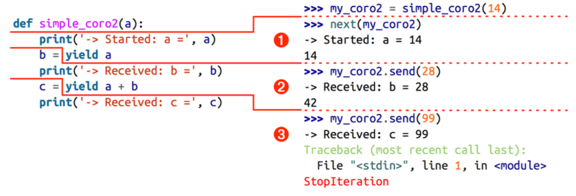
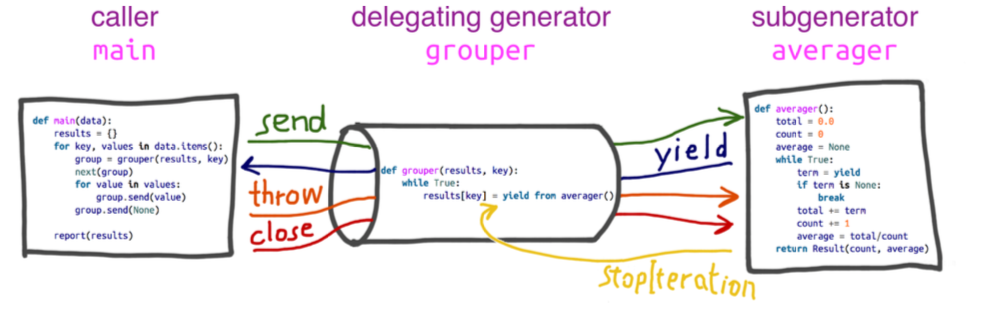

# #14. AsyncIO

##### 1. [coroutines](#coroutines)
2. [Yield from](#Yield-from)
3. [Futures](#Futures)
4. [Event loop](#Event-loop)
5. [asyncio](#asyncio)

#### coroutines

The infrastructure for coroutines appeared in *PEP 342 — Coroutines via Enhanced Generators*, implemented in Python 2.5 (2006): since then, the `yield` keyword can be used in an expression, and the `.send(value)` method was added to the generator API.
Using `.send(...)`, the caller of the generator can post data that then becomes the value of the `yield` expression inside the generator function. 

This allows a generator to be used as a __coroutine__: a procedure that collaborates with the caller, yielding and receiving values from the caller.

Or more general: __coroutines__ are computer-program components that generalize subroutines for non-preemptive multitasking, by allowing multiple entry points for suspending and resuming execution at certain locations


```python
from inspect import getgeneratorstate
```


```python
class DemoException(Exception):
    """An exception type for the demonstration."""


def demo_exc_handling():
    print('-> coroutine started')
    while True:
        try:
            x = yield
        except DemoException:
            print('*** DemoException handled. Continuing...')
        else:
            print('-> coroutine received: {!r}'.format(x))
    raise RuntimeError('This line should never run.')
```

We need to prime coroutine before use:


```python
exc_coro = demo_exc_handling()
exc_coro.send(42)
```


    ---------------------------------------------------------------------------

    TypeError                                 Traceback (most recent call last)

    <ipython-input-4-f2c614797933> in <module>()
          1 exc_coro = demo_exc_handling()
    ----> 2 exc_coro.send(42)
    

    TypeError: can't send non-None value to a just-started generator


The initial call `next(exc_coro)` is often described as “priming” the coroutine (i.e., advancing it to the first yield to make it ready for use as a live coroutine).


```python
exc_coro = demo_exc_handling()
next(exc_coro) # or exc_coro.send(None)
exc_coro.send(11)
exc_coro.send(42)
exc_coro.close()
print(getgeneratorstate(exc_coro))
```

    -> coroutine started
    -> coroutine received: 11
    -> coroutine received: 42
    GEN_CLOSED
    


```python
exc_coro = demo_exc_handling()
next(exc_coro)
exc_coro.send(11)
exc_coro.send(42)
exc_coro.throw(DemoException)
print(getgeneratorstate(exc_coro))
```

    -> coroutine started
    -> coroutine received: 11
    -> coroutine received: 42
    *** DemoException handled. Continuing...
    GEN_SUSPENDED
    

It’s crucial to understand that the execution of the coroutine is suspended exactly at the `yield` keyword. In an assignment statement, the code to the right of the `=` is evaluated before the actual assignment happens. This means that in a line like `b = yield a`, the value of `b` will only be set when the coroutine is activated later by the client code




```python
from functools import wraps

def coroutine(func):
    """Decorator: primes `func` by advancing to first `yield`"""
    @wraps(func)
    def primer(*args,**kwargs):
        gen = func(*args,**kwargs)
        next(gen)
        return gen
    return primer
```

The `yield from` syntax automatically primes the coroutine called by it, making it incompatible with decorators such as `@coroutine`. The `asyncio.coroutine` decorator from the Python 3.4 standard library is designed to work with `yield from` so it does not prime the coroutine.


```python
@coroutine
def averager():
    total = 0.0
    count = 0
    average = None
    while True:
        term = yield average
        total += term
        count += 1
        average = total/count
```


```python
coro_avg = averager() 
print(getgeneratorstate(coro_avg))
print(coro_avg.send(10))
print(coro_avg.send(30))
print(coro_avg.send(5))
```

    GEN_SUSPENDED
    10.0
    20.0
    15.0
    


```python
from collections import namedtuple

Result = namedtuple('Result', 'count average')

@coroutine
def averager():
    total = 0.0
    count = 0
    average = None
    while True:
        term = yield
        if term is None:
            break
        total += term
        count += 1
        average = total/count
    return Result(count, average) # Before Python 3.3, it was a syntax error to return a value in a generator function
```


```python
coro_avg = averager()
coro_avg.send(10)
coro_avg.send(30)
coro_avg.send(6.5)
try:
    coro_avg.send(None)
except StopIteration as exc:
    result = exc.value

print(result)
```

    Result(count=3, average=15.5)
    

This roundabout way of getting the return value from a coroutine makes more sense when we realize it was defined as part of *PEP 380*, and the `yield from` construct handles it automatically by catching `StopIteration` internally. This is analogous to the use of `StopIteration` in `for` loops: the exception is handled by the loop machinery in a way that is transparent to the user. In the case of `yield from`, the interpreter not only consumes the `StopIteration`, but its value attribute becomes the value of the `yield from` expression itself.

#### Yield from

The latest evolutionary step for coroutines came with *PEP 380 - Syntax for Delegating to a Subgenerator*, implemented in Python 3.3 (2012). *PEP 380* made two syntax changes to generator functions, to make them more useful as coroutines:
* A generator can now `return` a value; previously, providing a value to the return statement inside a generator raised a `SyntaxError`.
* The `yield from` syntax enables complex generators to be refactored into smaller, nested generators while avoiding a lot of boilerplate code previously required for a generator to delegate to subgenerators.


```python
def chain(*iterables):
    for it in iterables:
        #for e in it:
        #    yield e
        yield from it
        

s = 'ABC'
t = tuple(range(3))
list(chain(s, t))
```


    ['A', 'B', 'C', 0, 1, 2]


```python
# Example of flattening a nested sequence using subgenerators

from collections import Iterable

def flatten(items, ignore_types=(str, bytes)):
    for x in items:
        if isinstance(x, Iterable) and not isinstance(x, ignore_types):
            yield from flatten(x)
        else:
            yield x

items = [1, 2, [3, 4, [5, 6], 7], 8]

# Produces 1 2 3 4 5 6 7 8
for x in flatten(items):
    print(x)

items = ['Dave', 'Paula', ['Thomas', 'Lewis']]
for x in flatten(items):
    print(x)
```

    1
    2
    3
    4
    5
    6
    7
    8
    Dave
    Paula
    Thomas
    Lewis
    

Similar constructs in other languages are called `await`: when a generator `gen` calls `yield from subgen()`, the `subgen` takes over and will yield values to the caller of `gen`; the caller will in effect drive `subgen` directly. Meanwhile `gen` will be blocked, waiting until `subgen` terminates.

The main feature of `yield from` is to open a bidirectional channel from the outermost caller to the innermost subgenerator, so that values can be sent and yielded back and forth directly from them, and exceptions can be thrown all the way in without adding a lot of exception handling boilerplate code in the intermediate coroutines. This is what enables coroutine delegation in a way that was not possible before.




```python
from collections import namedtuple

data = {
    'girls;kg':
        [40.9, 38.5, 44.3, 42.2, 45.2, 41.7, 44.5, 38.0, 40.6, 44.5],
    'girls;m':
        [1.6, 1.51, 1.4, 1.3, 1.41, 1.39, 1.33, 1.46, 1.45, 1.43],
    'boys;kg':
        [39.0, 40.8, 43.2, 40.8, 43.1, 38.6, 41.4, 40.6, 36.3],
    'boys;m':
        [1.38, 1.5, 1.32, 1.25, 1.37, 1.48, 1.25, 1.49, 1.46],
}


Result = namedtuple('Result', 'count average')


# the subgenerator
def averager():
    total = 0.0
    count = 0
    average = None
    while True:
        term = yield
        if term is None:
            break
        total += term
        count += 1
        average = total/count
    return Result(count, average)


# the delegating generator
def grouper(results, key):
    while True:
        results[key] = yield from averager()

        
# the client code, a.k.a. the caller
def main(data):
    results = {}
    for key, values in data.items():
        group = grouper(results, key)
        next(group)
        for value in values:
            group.send(value)
        group.send(None)  # important!

    # print(results)  # uncomment to debug
    report(results)


# output report
def report(results):
    for key, result in sorted(results.items()):
        group, unit = key.split(';')
        print('{:2} {:5} averaging {:.2f}{}'.format(
              result.count, group, result.average, unit))

        
main(data)
```

     9 boys  averaging 40.42kg
     9 boys  averaging 1.39m
    10 girls averaging 42.04kg
    10 girls averaging 1.43m
    

Every yield from chain must be driven by a client that calls `next(...)` or `.send(...)` on the outermost delegating generator. This call may be implicit, such as a for loop.

*PEP 380* draft used to say about `yield from`:
“When the iterator is another generator, the effect is the same as if the body of the sub‐generator were inlined at the point of the `yield from` expression. Furthermore, the subgenerator is allowed to execute a return statement with a value, and that value becomes the value of the `yield from` expression.”

The approved version of *PEP 380* explains the behavior of yield from in six points in the Proposal section.:
* Any values that the subgenerator yields are passed directly to the caller of the delegating generator (i.e., the client code).
* Any values sent to the delegating generator using `send()` are passed directly to the subgenerator. If the sent value is `None`, the subgenerator’s `__next__()` method is called. If the sent value is not `None`, the subgenerator’s `send()` method is called. If the call raises `StopIteration`, the delegating generator is resumed. Any other exception is propagated to the delegating generator.
* `return expr` in a generator (or subgenerator) causes `StopIteration(expr)` to be raised upon exit from the generator.
* The value of the `yield from` expression is the first argument to the `StopIteration` exception raised by the subgenerator when it terminates.
* Exceptions other than `GeneratorExit` thrown into the delegating generator are passed to the `throw()` method of the subgenerator. If the call raises `StopIteration`, the delegating generator is resumed. Any other exception is propagated to the delegating generator.
* If a `GeneratorExit` exception is thrown into the delegating generator, or the `close()` method of the delegating generator is called, then the close() method of the subgenerator is called if it has one. If this call results in an exception, it is propagated to the delegating generator. Otherwise, `GeneratorExit` is raised in the delegating generator.

`RESULT = yield from EXPR` is semantically equivalent to


```python
_i = iter(EXPR)
try:
    _y = next(_i)
except StopIteration as _e:
    _r = _e.value
else:
    while 1:
        try:
            _s = yield _y
        except GeneratorExit as _e:
            try:
                _m = _i.close
            except AttributeError:
                pass
            else:
                _m()
            raise _e
        except BaseException as _e:
            _x = sys.exc_info()
            try:
                _m = _i.throw
            except AttributeError:
                raise _e
            else:
                try:
                    _y = _m(*_x)
                except StopIteration as _e:
                    _r = _e.value
                    break
        else:
            try:
                if _s is None:
                    _y = next(_i)
                else:
                    _y = _i.send(_s)
            except StopIteration as _e:
                _r = _e.value
                break
RESULT = _r
```

Compare to CSV files:


```python
import csv

def get_key(row):
    return row["!Sample_title"], row["!Sample_geo_accession"]

def load_csv(filename):
    """Put csv data into a dict that maps title/geo to the complete row.
    """
    d = {}
    with open(filename) as f:
        for row in csv.DictReader(f, delimiter=","):
            key = get_key(row)
            assert key not in d
            d[key] = row
    return d

def diffs(old, new):
    yield from added_or_removed("ADDED", new.keys() - old.keys(), new)
    yield from added_or_removed("REMOVED", old.keys() - new.keys(), old)
    yield from changed(old, new)

def compare_row(key, old, new):
    i = -1
    for i, line in enumerate(diffs(old, new)):
        if not i:
            print("/".join(key))
        print("    " + line)
    if i >= 0:
        print()

def added_or_removed(state, keys, d):
    items = sorted((key, d[key]) for key in keys)
    for key, value in items:
        yield "{:10}: {:30} | {:30}".format(state, key, value)

def changed(old, new):
    common_columns = old.keys() & new.keys()
    for column in sorted(common_columns):
        oldvalue = old[column]
        newvalue = new[column]
        if oldvalue != newvalue:
            yield "{:10}: {:30} | {:30} | {:30}".format(
            "CHANGED",
            column, 
            oldvalue.ljust(30),
            newvalue.ljust(30))

    
if __name__ == "__main__":
    oldcsv = load_csv("2.csv")
    newcsv = load_csv("1.csv")
    # title/geo pairs that occur in both files:
    common = oldcsv.keys() & newcsv.keys() 
    for key in sorted(common):
        compare_row(key, oldcsv[key], newcsv[key])
```

Simple parse:


```python
import re, sys
pat = re.compile(r"(\S+)|(<[^>]*>)")

text = "<foo> This is a <b> foo file </b> you know. </foo>"

def run():
    parser = parse_items()
    next(parser)
    try:
        for m in pat.finditer(text):
            token = m.group(0)
            print("Feeding:", repr(token))
            parser.send(token)
        parser.send(None) # to signal EOF
    except StopIteration as e:
        tree = e.value
        print(tree)

def parse_elem(opening_tag):
    name = opening_tag[1:-1]
    closing_tag = "</%s>" % name
    items = yield from parse_items(closing_tag)
    return (name, items)

def parse_items(closing_tag=None):
    elems = []
    while 1:
        token = yield
        if not token:
            break # EOF
        if is_opening_tag(token):
            e = yield from parse_elem(token)
            elems.append(e)
        elif token == closing_tag:
            break
        else:
            elems.append(token)
    return elems

def is_opening_tag(token):
    return token.startswith("<") and not token.startswith("</")

run()
```

    Feeding: '<foo>'
    Feeding: 'This'
    Feeding: 'is'
    Feeding: 'a'
    Feeding: '<b>'
    Feeding: 'foo'
    Feeding: 'file'
    Feeding: '</b>'
    Feeding: 'you'
    Feeding: 'know.'
    Feeding: '</foo>'
    [('foo', ['This', 'is', 'a', ('b', ['foo', 'file']), 'you', 'know.'])]
    

Generators in Python 2.2 let the execution of code be paused. Once the ability to send values back into the paused generators were introduced in Python 2.5, the concept of coroutines in Python became possible. And the addition of `yield from` in Python 3.3 made it easier to refactor generators as well as chain them together.

#### Futures

As of Python 3.4, there are two classes named Future in the standard library: `concurrent.futures.Future` and `asyncio.Future`. They serve the same purpose: an instance of either `Future` class represents a deferred computation that may or may not have completed. This is similar to the Deferred class in Twisted, the Future class in Tornado, and Promise objects in various JavaScript libraries.

`asyncio.Future(*, loop=None)` is almost compatible with `concurrent.futures.Future`. Differences:
* `result()` and `exception()` do not take a `timeout` argument and raise an exception when the future isn’t done yet.
* Callbacks registered with `add_done_callback()` are always called via the event loop’s `call_soon_threadsafe()`.
* This class is not compatible with the `wait()` and `as_completed()` functions in the `concurrent.futures` package.
* This class is not thread safe.

Futures encapsulate pending operations so that they can be put in queues, their state of completion can be queried, and their results (or exceptions) can be retrieved when available.

An important thing to know about futures in general is that you should not create them: they are meant to be instantiated exclusively by the concurrency framework, be it `concurrent.futures` or `asyncio`


```python
import os
import time
import sys

POP20_CC = ('CN IN US ID BR PK NG BD RU JP '
            'MX PH VN ET EG DE IR TR CD FR').split()

BASE_URL = 'http://flupy.org/data/flags'

DEST_DIR = '/Users/s.stupnikov/Coding/otus/otus-python-0717/lection16/downloads/'

MAX_WORKERS = 20


def save_flag(img, filename):
    path = os.path.join(DEST_DIR, filename)
    with open(path, 'wb') as fp:
        fp.write(img)


def get_flag(cc):
    url = '{}/{cc}/{cc}.gif'.format(BASE_URL, cc=cc.lower())
    resp = requests.get(url)
    return resp.content


def show(text):
    print(text, end=' ')
    sys.stdout.flush()

    
def download_one(cc):
    image = get_flag(cc)
    show(cc)
    save_flag(image, cc.lower() + '.gif')
    return cc

def main(download_many):
    t0 = time.time()
    count = download_many(POP20_CC)
    elapsed = time.time() - t0
    msg = '\n{} flags downloaded in {:.2f}s'
    print(msg.format(count, elapsed))

```

The main features of the `concurrent.futures` package are the `ThreadPoolExecutor` and `ProcessPoolExecutor` classes, which implement an interface that allows you to submit callables for execution in different threads or processes, respectively. The classes manage an internal pool of worker threads or processes, and a queue of tasks to be executed


```python
from concurrent import futures

import requests


MAX_WORKERS = 20


def download_one(cc):
    image = get_flag(cc)
    show(cc)
    save_flag(image, cc.lower() + '.gif')
    return cc


def download_many(cc_list):
    workers = min(MAX_WORKERS, len(cc_list))
    with futures.ThreadPoolExecutor(workers) as executor:
        res = executor.map(download_one, sorted(cc_list))

    return len(list(res))

if __name__ == '__main__':
    main(download_many)
```

    VNPKNGEGPHJPDERUTRFRBDINIDCNBR               ETMXUS   IR CD 
    20 flags downloaded in 3.19s
    

To get a practical look at futures, we can rewrite previous example to use the `concurrent.futures.as_completed` function, which takes an iterable of futures and returns an iterator that yields futures as they are done.


```python
from concurrent import futures

import requests


def download_many(cc_list):
    cc_list = cc_list[:5]
    with futures.ThreadPoolExecutor(max_workers=3) as executor:
        to_do = []
        for cc in sorted(cc_list):
            future = executor.submit(download_one, cc)
            to_do.append(future)
            msg = 'Scheduled for {}: {}'
            print(msg.format(cc, future))

        results = []
        for future in futures.as_completed(to_do):
            res = future.result()
            msg = '{} result: {!r}'
            print(msg.format(future, res))
            results.append(res)

    return len(results)


def main(download_many):
    t0 = time.time()
    count = download_many(POP20_CC)
    elapsed = time.time() - t0
    msg = '\n{} flags downloaded in {:.2f}s'
    print(msg.format(count, elapsed))

    
main(download_many)
```

    Scheduled for BR: <Future at 0x10bb55b70 state=running>
    Scheduled for CN: <Future at 0x10c402f98 state=running>
    Scheduled for ID: <Future at 0x10c412860 state=running>
    Scheduled for IN: <Future at 0x10c4081d0 state=pending>
    Scheduled for US: <Future at 0x10c412dd8 state=pending>
    ID BRCN  <Future at 0x10c412860 state=finished returned str> result: 'ID'
    <Future at 0x10bb55b70 state=finished returned str> result: 'BR'
    <Future at 0x10c402f98 state=finished returned str> result: 'CN'
    IN <Future at 0x10c4081d0 state=finished returned str> result: 'IN'
    US <Future at 0x10c412dd8 state=finished returned str> result: 'US'
    
    5 flags downloaded in 0.48s
    

Compute the SHA-256 hash of a dozen 1 MB byte arrays with the standard library `hashlib` package, which uses the OpenSSL library:


```python
import sys
import time
import hashlib
from concurrent import futures
from random import randrange

JOBS = 12
SIZE = 2**20
STATUS = '{} workers, elapsed time: {:.2f}s'


def sha(size):
    data = bytearray(randrange(256) for i in range(size))
    algo = hashlib.new('sha256')
    algo.update(data)
    return algo.hexdigest()


def main(workers=None):
    if workers:
        workers = int(workers)
    t0 = time.time()

    with futures.ProcessPoolExecutor(workers) as executor:
        actual_workers = executor._max_workers
        to_do = (executor.submit(sha, SIZE) for i in range(JOBS))
        for future in futures.as_completed(to_do):
            res = future.result()
            print(res)

    print(STATUS.format(actual_workers, time.time() - t0))

if __name__ == '__main__':
    if len(sys.argv) == 2:
        workers = int(sys.argv[1])
    else:
        workers = None
    main(workers)
```

    076b1d856f88d49e6f187f4d67cdbc40c7dc06cbf32fa2eae32b169effb15ab4
    b4b0e6516b13f14d24789a614bb21ae3137915bc723d45bc5297d7d5aecc07f4
    dd5b03701d1e56575dfea31f076958b28a75b82a58ad131eb2b194a19066f0e0
    51bfae8ace8f85b6e4ae8fc04299b021bcbf2960f62c87c5941d7d84e74718d4
    ce2ed28a43b17b2aecebb6e85a83dee4dd13327ecfbcb12f92138609bcd9e5a0
    9044b22c14dd3cadc9a4ddb57a2efad0df6a929b8b35d6eebb0427c6709a74d6
    4c336055973ca4546002631235b1a37ff29a0a04187c9d3e634c9a50276d661a
    e3facaad84a053e55d21b54de35aae2aaa369467b68c2cce5a259313bf77b951
    37dd5c12ee617dc53c46c00cd28fc99821aa6abe47c04a7e7eb82d2008095722
    bf696d8da2790b44dfee6e4ac7f5c2506c713a91038df7c95816dca0155264c8
    5c74488e43e361fd46267da38c23674a29130f2a4faa9f8f6d95dc2ba00acee0
    ffc79ab350262b99e07a11219305ae7fe4c9e24f521fad67f7aec5f10aae21ce
    4 workers, elapsed time: 14.63s
    

Inline future formulation with exception handling added


```python
class Task:
    def __init__(self, gen):
        self._gen = gen

    def step(self, value=None, exc=None):
        try:
            if exc:
                fut = self._gen.throw(exc)
            else:
                fut = self._gen.send(value)
            fut.add_done_callback(self._wakeup)
        except StopIteration as exc:
            pass

    def _wakeup(self, fut):
        try:
            result = fut.result()
            self.step(result, None)
        except Exception as exc:
            self.step(None, exc)

# Example
if __name__ == '__main__':
    from concurrent.futures import ThreadPoolExecutor
    import time

    pool = ThreadPoolExecutor(max_workers=8)

    def func(x, y):
        time.sleep(1)
        return x + y

    def do_func(x, y):
        try:
            result = yield pool.submit(func, x, y)
            print('Got:', result, end="\n\n")
        except Exception as e:
            print('Failed:', repr(e))

    t = Task(do_func(2,3))
    t.step()

    t = Task(do_func(2, 'Hello'))
    t.step()
```

    Got: 5
    
    Failed: TypeError("unsupported operand type(s) for +: 'int' and 'str'",)
    

#### Event loop

In Python's case, `asyncio` was added to the standard library to provide an event loop. There's a focus on networking in `asyncio` which in the case of the event loop is to make the "when A happens" to be when I/O from a socket is ready for reading and/or writing (via the `selectors` module). Other than GUIs and I/O, event loops are also often used for executing code in another thread or subprocess and have the event loop act as the scheduler (i.e., cooperative multitasking). If you happen to understand Python's GIL, event loops are useful in cases where releasing the GIL is possible and useful.


```python
class EventHandler:
    def fileno(self):
        'Return the associated file descriptor'
        raise NotImplemented('must implement')

    def wants_to_receive(self):
        'Return True if receiving is allowed'
        return False

    def handle_receive(self):
        'Perform the receive operation'
        pass

    def wants_to_send(self):
        'Return True if sending is requested' 
        return False

    def handle_send(self):
        'Send outgoing data'
        pass

import select

def event_loop(handlers):
    while True:
        wants_recv = [h for h in handlers if h.wants_to_receive()]
        wants_send = [h for h in handlers if h.wants_to_send()]
        can_recv, can_send, _ = select.select(wants_recv, wants_send, [])
        for h in can_recv:
            h.handle_receive()
        for h in can_send:
            h.handle_send()
```


```python
import socket
import time

from eventhandler import EventHandler, event_loop

class UDPServer(EventHandler):
    def __init__(self, address):
        self.sock = socket.socket(socket.AF_INET, socket.SOCK_DGRAM)
        self.sock.bind(address)

    def fileno(self):
        return self.sock.fileno()

    def wants_to_receive(self):
        return True

class UDPTimeServer(UDPServer):
    def handle_receive(self):
        msg, addr = self.sock.recvfrom(1)
        self.sock.sendto(time.ctime().encode('ascii'), addr)

class UDPEchoServer(UDPServer):
    def handle_receive(self):
        msg, addr = self.sock.recvfrom(8192)
        self.sock.sendto(msg, addr)

if __name__ == '__main__':
    handlers = [ UDPTimeServer(('',14000)), UDPEchoServer(('',15000))  ]
    event_loop(handlers)
```

#### asyncio

`asyncio`, a package that implements concurrency with coroutines driven by an event loop. It’s one of the largest and most ambitious libraries ever added to Python. Guido van Rossum developed asyncio outside of the Python repository and gave the project a code name of “Tulip”—so you’ll see references to that flower when researching this topic online. For example, the main discussion group is still called python-tulip.
Tulip was renamed to asyncio when it was added to the standard library in Python 3.4.


```python
import threading
import itertools
import time
import sys


def spin(msg, done):
    write, flush = sys.stdout.write, sys.stdout.flush
    for char in itertools.cycle('|/-\\'):
        status = char + ' ' + msg
        write(status)
        flush()
        write('\x08' * len(status))
        if done.wait(.1):
            break
    write(' ' * len(status) + '\x08' * len(status))


def slow_function():
    # pretend waiting a long time for I/O
    time.sleep(3)
    return 42


def supervisor():
    done = threading.Event()
    spinner = threading.Thread(target=spin,
                               args=('thinking!', done))
    print('spinner object:', spinner)
    spinner.start()
    result = slow_function()
    done.set()
    spinner.join()
    return result


def main():
    result = supervisor()
    print('Answer:', result)


main()
```

    spinner object: <Thread(Thread-5, initial)>
    | thinking/ thinking- thinking\ thinking| thinking/ thinking- thinking\ thinking| thinking/ thinking- thinking\ thinking| thinking/ thinking- thinking\ thinking| thinking/ thinking- thinking\ thinking| thinking/ thinking- thinking\ thinking| thinking/ thinking- thinking\ thinking| thinking          Answer: 42
    


AsyncIO spinner:


```python
import asyncio
import itertools
import sys


@asyncio.coroutine
def spin(msg):
    write, flush = sys.stdout.write, sys.stdout.flush
    for char in itertools.cycle('|/-\\'):
        status = char + ' ' + msg
        write(status)
        flush()
        write('\x08' * len(status))
        try:
            yield from asyncio.sleep(.1)
        except asyncio.CancelledError:
            break
    write(' ' * len(status) + '\x08' * len(status))


@asyncio.coroutine
def slow_function():
    # pretend waiting a long time for I/O
    yield from asyncio.sleep(3)
    return 42


@asyncio.coroutine
def supervisor():
    spinner = asyncio.ensure_future(spin('thinking!'))
    print('spinner object:', spinner)
    result = yield from slow_function()
    spinner.cancel()
    return result


def main():
    loop = asyncio.get_event_loop()
    result = loop.run_until_complete(supervisor())
    loop.close()
    print('Answer:', result)


main()
```

    spinner object: <Task pending coro=<spin() running at <ipython-input-1-3971047b2aec>:6>>
    | thinking/ thinking- thinking\ thinking| thinking/ thinking- thinking\ thinking| thinking/ thinking- thinking\ thinking| thinking/ thinking- thinking\ thinking| thinking/ thinking- thinking\ thinking| thinking/ thinking- thinking\ thinking| thinking/ thinking- thinking\ thinking| thinking          Answer: 42
    


```python
import asyncio
import itertools
import sys


async def spin(msg):
    write, flush = sys.stdout.write, sys.stdout.flush
    for char in itertools.cycle('|/-\\'):
        status = char + ' ' + msg
        write(status)
        flush()
        write('\x08' * len(status))
        try:
            await asyncio.sleep(.1)
        except asyncio.CancelledError:
            break
    write(' ' * len(status) + '\x08' * len(status))


async def slow_function():
    # pretend waiting a long time for I/O
    await asyncio.sleep(3)
    return 42


async def supervisor():
    spinner = asyncio.ensure_future(spin('thinking!'))
    print('spinner object:', spinner)
    result = await slow_function()
    spinner.cancel()
    return result


def main():
    loop = asyncio.get_event_loop()
    result = loop.run_until_complete(supervisor())
    loop.close()
    print('Answer:', result)


main()
```

    spinner object: <Task pending coro=<spin() running at <ipython-input-1-4b6a3a1d2b81>:6>>
    | thinking/ thinking- thinking\ thinking| thinking/ thinking- thinking\ thinking| thinking/ thinking- thinking\ thinking| thinking/ thinking- thinking\ thinking| thinking/ thinking- thinking\ thinking| thinking/ thinking- thinking\ thinking| thinking/ thinking- thinking\ thinking| thinking          Answer: 42
    

There are functional differences between native coroutines using `async def` syntax and generator-based coroutines using the `asyncio.coroutine` decorator
* Native coroutine objects do not implement \__iter\__ and  \__next\__ methods. Therefore, they cannot be iterated over or passed to iter(), list(), tuple() and other built-ins. They also cannot be used in a `for..in` loop. An attempt to use \__iter\__ or \__next\__ on a native coroutine object will result in a `TypeError` .
* Plain generators cannot `yield from` native coroutines: doing so will result in a `TypeError` .
* generator-based coroutines can `yield from` native coroutine objects.
* `inspect.isgenerator()` and `inspect.isgeneratorfunction()` return False for native coroutine objects and native coroutine functions.


```python
@asyncio.coroutine
def py34_coro():
    yield from stuff()
```


```python
async def py35_coro():
    await stuff()
```


```python
import dis
dis.dis(py34_coro)
```

      3           0 LOAD_GLOBAL              0 (stuff)
                  2 CALL_FUNCTION            0
                  4 GET_YIELD_FROM_ITER
                  6 LOAD_CONST               0 (None)
                  8 YIELD_FROM
                 10 POP_TOP
                 12 LOAD_CONST               0 (None)
                 14 RETURN_VALUE
    

In the case of GET_YIELD_FROM_ITER, it simply checks if its argument is a generator or coroutine, otherwise it calls iter() on its argument 


```python
dis.dis(py35_coro)
```

      2           0 LOAD_GLOBAL              0 (stuff)
                  2 CALL_FUNCTION            0
                  4 GET_AWAITABLE
                  6 LOAD_CONST               0 (None)
                  8 YIELD_FROM
                 10 POP_TOP
                 12 LOAD_CONST               0 (None)
                 14 RETURN_VALUE
    

But GET_AWAITABLE does something different. While the bytecode will accept a coroutine just like GET_YIELD_FROM_ITER, it will not accept a generator if has not been flagged as a coroutine. Beyond just coroutines, though, the bytecode will accepted an awaitable object. This makes yield from expressions and await expressions both accept coroutines while differing on whether they accept plain generators or awaitable objects, respectively.

An awaitable object is either a coroutine or an object that defines `__await__()` -- technically `collections.abc.Awaitable` -- which returns an iterator that is not a coroutine. An await expression is basically yield from but with restrictions of only working with awaitable objects


```python
def isawaitable(object):
    """Return true if object can be passed to an ``await`` expression."""
    return (isinstance(object, types.CoroutineType) or
            isinstance(object, types.GeneratorType) and
                bool(object.gi_code.co_flags & CO_ITERABLE_COROUTINE) or
            isinstance(object, collections.abc.Awaitable))
```

Async flag downloader


```python
import os
import sys
import time
import asyncio

import aiohttp


async def get_flag(cc):
    url = '{}/{cc}/{cc}.gif'.format(BASE_URL, cc=cc.lower())
    async with aiohttp.ClientSession() as session:
        resp = await session.request('GET', url)
        image = await resp.read()
        return image


async def download_one(cc):
    image = await get_flag(cc)
    show(cc)
    save_flag(image, cc.lower() + '.gif')
    return cc


def download_many(cc_list):
    loop = asyncio.get_event_loop()
    to_do = [download_one(cc) for cc in sorted(cc_list)]
    wait_coro = asyncio.wait(to_do)
    res, _ = loop.run_until_complete(wait_coro)
    loop.close()

    return len(res)


def main(download_many):
    t0 = time.time()
    count = download_many(POP20_CC)
    elapsed = time.time() - t0
    msg = '\n{} flags downloaded in {:.2f}s'
    print(msg.format(count, elapsed))


main(download_many)
```

    IN RU FR BD ID PK PH VN DE EG CD CN BR ET US MX NG JP TR IR 
    20 flags downloaded in 0.79s
    


```python
import asyncio
import collections
import contextlib

import aiohttp
from aiohttp import web
import tqdm

from flags2_common import main, HTTPStatus, Result, save_flag

# default set low to avoid errors from remote site, such as
# 503 - Service Temporarily Unavailable
DEFAULT_CONCUR_REQ = 5
MAX_CONCUR_REQ = 1000


class FetchError(Exception):
    def __init__(self, country_code):
        self.country_code = country_code


@asyncio.coroutine
def get_flag(base_url, cc):
    url = '{}/{cc}/{cc}.gif'.format(base_url, cc=cc.lower())
    resp = yield from aiohttp.request('GET', url)
    with contextlib.closing(resp):
        if resp.status == 200:
            image = yield from resp.read()
            return image
        elif resp.status == 404:
            raise web.HTTPNotFound()
        else:
            raise aiohttp.HttpProcessingError(
                code=resp.status, message=resp.reason,
                headers=resp.headers)


@asyncio.coroutine
def download_one(cc, base_url, semaphore, verbose):
    try:
        with (yield from semaphore):
            image = yield from get_flag(base_url, cc)
    except web.HTTPNotFound:
        status = HTTPStatus.not_found
        msg = 'not found'
    except Exception as exc:
        raise FetchError(cc) from exc
    else:
        loop = asyncio.get_event_loop()
        loop.run_in_executor(None, save_flag, image, cc.lower() + '.gif')
        status = HTTPStatus.ok
        msg = 'OK'

    if verbose and msg:
        print(cc, msg)

    return Result(status, cc)

@asyncio.coroutine
def downloader_coro(cc_list, base_url, verbose, concur_req):
    counter = collections.Counter()
    semaphore = asyncio.Semaphore(concur_req)
    to_do = [download_one(cc, base_url, semaphore, verbose)
             for cc in sorted(cc_list)]

    to_do_iter = asyncio.as_completed(to_do)
    if not verbose:
        to_do_iter = tqdm.tqdm(to_do_iter, total=len(cc_list))
    for future in to_do_iter:
        try:
            res = yield from future
        except FetchError as exc:
            country_code = exc.country_code
            try:
                error_msg = exc.__cause__.args[0]
            except IndexError:
                error_msg = exc.__cause__.__class__.__name__
            if verbose and error_msg:
                msg = '*** Error for {}: {}'
                print(msg.format(country_code, error_msg))
            status = HTTPStatus.error
        else:
            status = res.status

        counter[status] += 1

    return counter


def download_many(cc_list, base_url, verbose, concur_req):
    loop = asyncio.get_event_loop()
    coro = downloader_coro(cc_list, base_url, verbose, concur_req)
    counts = loop.run_until_complete(coro)
    loop.close()

    return counts


if __name__ == '__main__':
    main(download_many, DEFAULT_CONCUR_REQ, MAX_CONCUR_REQ)
```

TCP Echo server


```python
import asyncio

async def handle_echo(reader, writer):
    data = await reader.read(100)
    message = data.decode()
    addr = writer.get_extra_info('peername')
    print("Received %r from %r" % (message, addr))

    print("Send: %r" % message)
    writer.write(data)
    await writer.drain()

    print("Close the client socket")
    writer.close()

loop = asyncio.get_event_loop()
coro = asyncio.start_server(handle_echo, '127.0.0.1', 8888, loop=loop)
server = loop.run_until_complete(coro)

# Serve requests until Ctrl+C is pressed
print('Serving on {}'.format(server.sockets[0].getsockname()))
try:
    loop.run_forever()
except KeyboardInterrupt:
    pass

# Close the server
server.close()
loop.run_until_complete(server.wait_closed())
loop.close()
```

TCP Echo client


```python
import asyncio


async def tcp_echo_client(message, loop):
    reader, writer = await asyncio.open_connection('127.0.0.1', 8888,
                                                   loop=loop)

    print('Send: %r' % message)
    writer.write(message.encode())

    data = await reader.read(100)
    print('Received: %r' % data.decode())

    print('Close the socket')
    writer.close()


message = 'Hello World!'
loop = asyncio.get_event_loop()
loop.run_until_complete(tcp_echo_client(message, loop))
loop.close()
```

Async subprocess


```python
import asyncio


async def run_command(*args):
    # Create subprocess
    process = await asyncio.create_subprocess_exec(
        *args,
        # stdout must a pipe to be accessible as process.stdout
        stdout=asyncio.subprocess.PIPE)
    # Wait for the subprocess to finish
    stdout, stderr = await process.communicate()
    # Return stdout
    return stdout.decode().strip()


loop = asyncio.get_event_loop()
# Gather uname and date commands
commands = asyncio.gather(run_command('uname'), run_command('date'))
# Run the commands
uname, date = loop.run_until_complete(commands)
# Print a report
print('uname: {}, date: {}'.format(uname, date))
loop.close()
```

    uname: Darwin, date: пятница,  2 марта 2018 г. 11:18:55 (MSK)
    

Exception handling


```python
import asyncio
import argparse
import logging
from functools import partial
from datetime import datetime
from random import randint

import aiohttp
import async_timeout


LOGGER_FORMAT = '%(asctime)s %(message)s'
URL_TEMPLATE = "https://hacker-news.firebaseio.com/v0/item/{}.json"
TOP_STORIES_URL = "https://hacker-news.firebaseio.com/v0/topstories.json"
FETCH_TIMEOUT = 10
MAXIMUM_FETCHES = 5

parser = argparse.ArgumentParser(
    description='Calculate the number of comments of the top stories in HN.')
parser.add_argument(
    '--period', type=int, default=5, help='Number of seconds between poll')
parser.add_argument(
    '--limit', type=int, default=5,
    help='Number of new stories to calculate comments for')
parser.add_argument('--verbose', action='store_true', help='Detailed output')


logging.basicConfig(format=LOGGER_FORMAT, datefmt='[%H:%M:%S]')
log = logging.getLogger()
log.setLevel(logging.INFO)


class BoomException(Exception):
    pass


class URLFetcher():
    """Provides counting of URL fetches for a particular task.
    """

    def __init__(self):
        self.fetch_counter = 0

    async def fetch(self, session, url):
        """Fetch a URL using aiohttp returning parsed JSON response.
        As suggested by the aiohttp docs we reuse the session.
        """
        with async_timeout.timeout(FETCH_TIMEOUT):
            self.fetch_counter += 1
            if self.fetch_counter > MAXIMUM_FETCHES:
                raise BoomException('BOOM!')
            elif randint(0, 3) == 0:
                raise Exception('Random generic exception')

            async with session.get(url) as response:
                return await response.json()


async def post_number_of_comments(loop, session, fetcher, post_id):
    """Retrieve data for current post and recursively for all comments.
    """
    url = URL_TEMPLATE.format(post_id)
    try:
        response = await fetcher.fetch(session, url)
    except BoomException as e:
        log.error("Error retrieving post {}: {}".format(post_id, e))
        raise e

    # base case, there are no comments
    if response is None or 'kids' not in response:
        return 0

    # calculate this post's comments as number of comments
    number_of_comments = len(response['kids'])

    # create recursive tasks for all comments
    tasks = [post_number_of_comments(
        loop, session, fetcher, kid_id) for kid_id in response['kids']]

    # schedule the tasks and retrieve results
    try:
        results = await asyncio.gather(*tasks)
    except BoomException as e:
        log.error("Error retrieving comments for top stories: {}".format(e))
        raise

    # reduce the descendents comments and add it to this post's
    number_of_comments += sum(results)
    log.debug('{:^6} > {} comments'.format(post_id, number_of_comments))

    return number_of_comments


async def get_comments_of_top_stories(loop, session, limit, iteration):
    """Retrieve top stories in HN.
    """
    fetcher = URLFetcher()  # create a new fetcher for this task
    try:
        response = await fetcher.fetch(session, TOP_STORIES_URL)
    except Exception as e:
        log.error("Error retrieving top stories: {}".format(e))
        raise

    tasks = [post_number_of_comments(
        loop, session, fetcher, post_id) for post_id in response[:limit]]

    try:
        results = await asyncio.gather(*tasks)
    except Exception as e:
        log.error("Error retrieving comments for top stories: {}".format(e))
        raise

    for post_id, num_comments in zip(response[:limit], results):
        log.info("Post {} has {} comments ({})".format(
            post_id, num_comments, iteration))
    return fetcher.fetch_counter  # return the fetch count


async def poll_top_stories_for_comments(loop, session, period, limit):
    """Periodically poll for new stories and retrieve number of comments.
    """
    iteration = 1
    errors = []
    while True:
        if errors:
            log.info('Error detected, quitting')
            return

        log.info("Calculating comments for top {} stories. ({})".format(
            limit, iteration))

        future = asyncio.ensure_future(
            get_comments_of_top_stories(loop, session, limit, iteration))

        now = datetime.now()

        def callback(fut):
            try:
                fetch_count = fut.result()
            except BoomException as e:
                log.debug('Adding {} to errors'.format(e))
                errors.append(e)
            except Exception as e:
                log.exception('Unexpected error')
                errors.append(e)
            else:
                log.info(
                    '> Calculating comments took {:.2f} seconds and {} fetches'.format(
                        (datetime.now() - now).total_seconds(), fetch_count))

        future.add_done_callback(callback)

        log.info("Waiting for {} seconds...".format(period))
        iteration += 1
        await asyncio.sleep(period)


if __name__ == '__main__':
    args = parser.parse_args()
    if args.verbose:
        log.setLevel(logging.DEBUG)

    loop = asyncio.get_event_loop()
    with aiohttp.ClientSession(loop=loop) as session:
        loop.run_until_complete(
            poll_top_stories_for_comments(
                loop, session, args.period, args.limit))

    loop.close()
```

### References

* http://flupy.org/resources/yield-from.pdf
* https://www.python.org/dev/peps/pep-0380/#proposal
* https://groups.google.com/forum/#!msg/python-tulip/bmphRrryuFk/aB45sEJUomYJ
* https://www.youtube.com/watch?v=1coLC-MUCJc
* https://stackoverflow.com/questions/40571786/asyncio-coroutine-vs-async-def
* https://lwn.net/Articles/643786/
* https://hackernoon.com/asyncio-for-the-working-python-developer-5c468e6e2e8e
* https://medium.com/python-pandemonium/asyncio-coroutine-patterns-beyond-await-a6121486656f
* https://medium.com/@yeraydiazdiaz/asyncio-coroutine-patterns-errors-and-cancellation-3bb422e961ff
* http://aosabook.org/en/500L/a-web-crawler-with-asyncio-coroutines.html
* https://asyncio.readthedocs.io/en/latest/index.html
* http://lucumr.pocoo.org/2016/10/30/i-dont-understand-asyncio/
* https://snarky.ca/how-the-heck-does-async-await-work-in-python-3-5/
* https://vorpus.org/blog/some-thoughts-on-asynchronous-api-design-in-a-post-asyncawait-world/
* https://www.pythonsheets.com/notes/python-asyncio.html

### Summary

* new asyncIO thing is quite powerful
* async is a framework doing all heavy lifting you don't need to worry about
* don't block event loop
