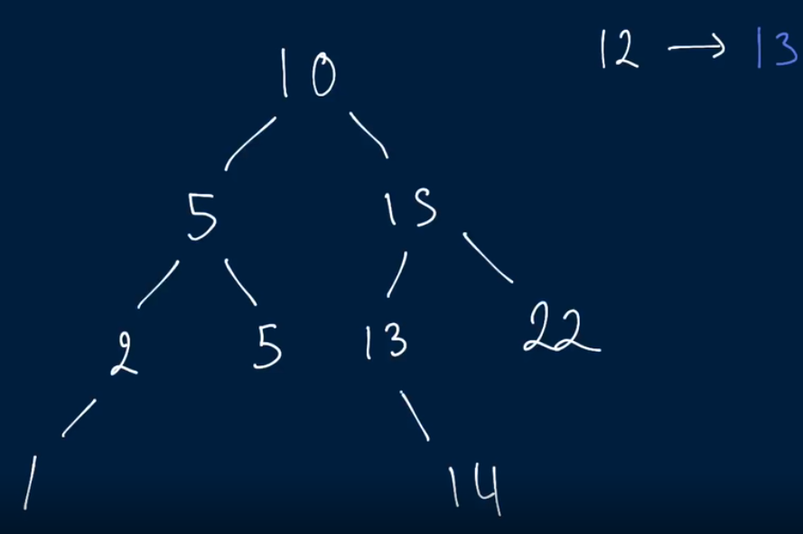
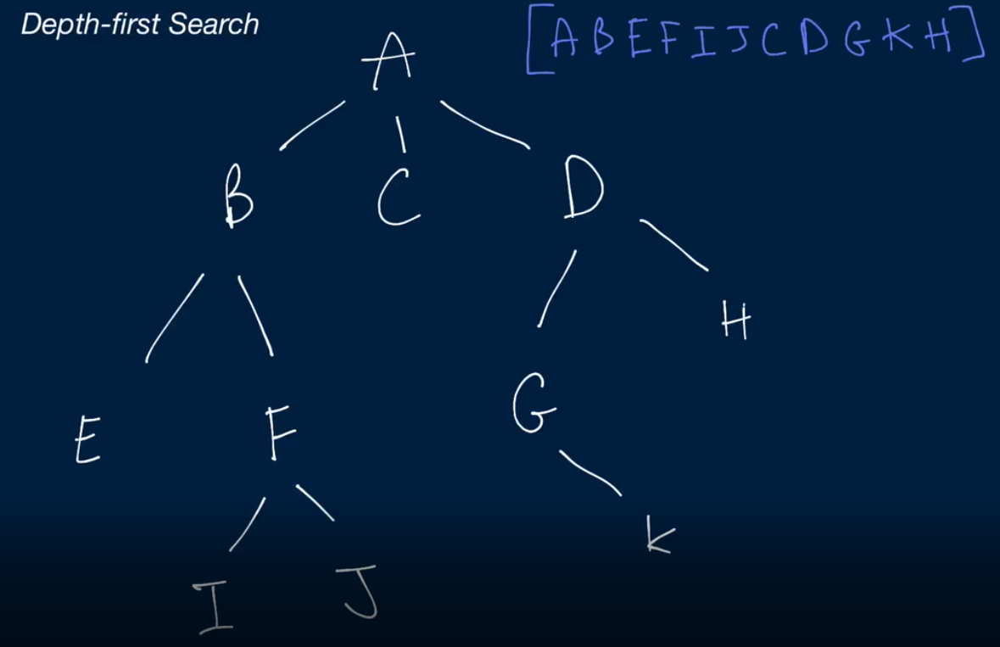
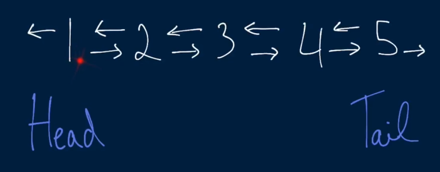
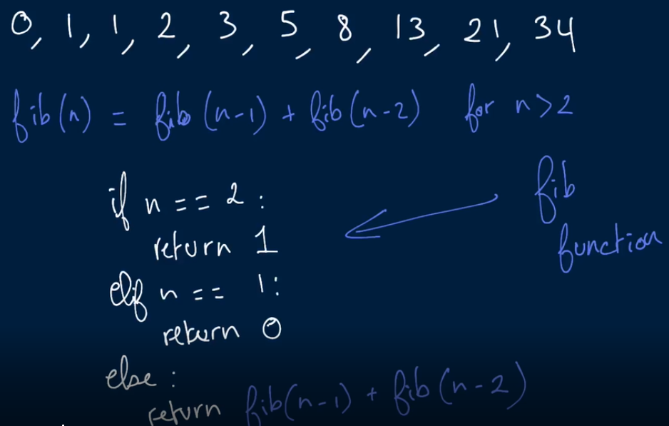
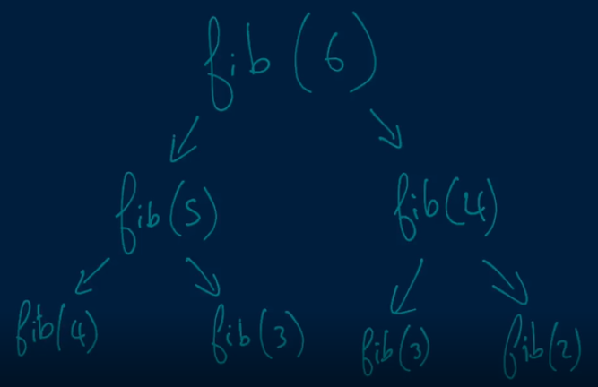
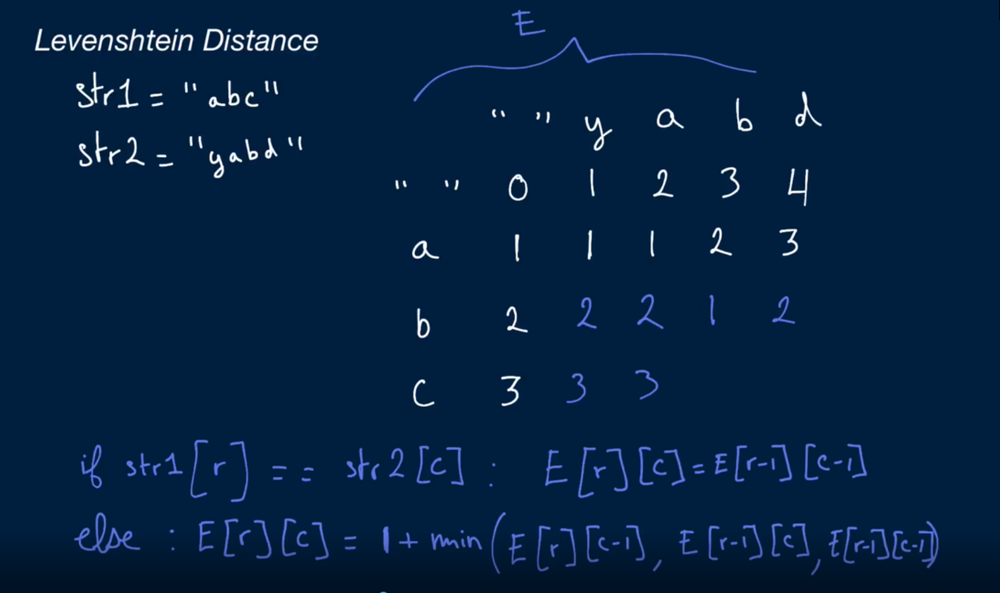

## Basic algoritms with AlgoExpoert

### Easy
- ###### [Two number sum in array](#two_number_sum)
- ###### [Find closest value in binary search tree](#find_closest_value_in_bst)
- ###### [Depth first search](#depth_first_search)
- ###### [Linked List Construction](#linked_list_construction)
- ###### [Nth fibonacci](#nth_fibonacci_algo)
- ###### [Find Three largest numbers](#find_three_largest_numbers)
- ###### [Binary search](#binary_search_algo)
- ###### [Insertion sort](#insertion_sort_algo)
- ###### [Bubble sort](#bubble_sort_algo)
- ###### [Selection sort](#selection_sort_algo)
- ###### [Palindrome check](#palindrome_check_algo)
- ###### [Caesar cipher encryptor](#caesar_cipher_encryptor_algo)

### Medium
- ###### [Three number sum](#three_number_sum)
- ###### [Smallest Difference](#smallest_difference)
- ###### [BST contruction](#binary_search_tree_contruction)
- ###### [Validate BST](#validate_binary_search_tree)
- ###### [BST Traversal](#bst_traversal)
- ###### [Invert BT](#invert_bt)
- ###### [Max subset sum no adjacent](#max_subset_sum_no_adjacent)
- ###### [Levenshtein distance](#levenshtein_distance)

### Hard
- ###### [Four number sum](#four_number_sum)
- ###### [Subarray sort](#subarray_sort)
- ###### [Largest range](#largest_range)
...


### Very Hard
...
- ###### [Longest increasing subsequence](#longest_increasing_subsequence)


#### two_number_sum

task: [-4, -1, 1, 3, 5, 6, 8, 11], 10
```python
# O(n) time | O(n) space
def two_number_sum(array, target_sum):
    nums = {}
    for num in array:
        potential_match = target_sum - num
        if potential_match in nums:
            return [potential_match, num]
        else:
            nums[num] = True
    return []

# O(nlog(n)) | O(1) space
def two_number_sum2(array, target_sum):
    array.sort()
    left = 0
    right = len(array) - 1
    while left < right:
        current_sum = array[left] + array[right]
        if current_sum == target_sum:
            return [array[left], array[right]]
        elif current_sum < target_sum:
            left += 1
        elif current_sum > target_sum:
            right -= 1
    return []
```

#### find_closest_value_in_bst



```python
# average: O(Log(n)) time | O(Log(n)) space
# Worst: O(n) time | O(n) space

def find_closest_value_in_bst(tree, target):
    return find_closest_value_in_bst_helper(tree, target, float("inf"))

def find_closest_value_in_bst_helper(tree, target, closest):
    if tree is None:
        return closest
    if abs(target - closest) > abs(target - tree.value):
        closest = tree.value
    if target < tree.value:
        return find_closest_value_in_bst_helper(tree.left, target, closest)
    elif target > tree.value:
        return find_closest_value_in_bst_helper(tree.right, target, closest)
    else:
        return closest
```

```python
# average: O(Log(n)) time | O(Log(1)) space
# Worst: O(n) time | O(1) space

def find_closest_value_in_bst(tree, target):
    return find_closest_value_in_bst_helper(tree, target, float("inf"))

def find_closest_value_in_bst_helper(tree, target, closest):
    current_node = tree
    while current_node is not None:
        if abs(target - closest) > abs(target - current_node.value):
            closest = current_node.value
        if target < current_node.value:
            current_node = current_node.left
        elif target > current_node.value:
            current_node = current_node.right
        else:
            break
    return closest
```

#### depth_first_search


```python
class Node:
    def __init__(self, name):
        self.children = []
        self.name = name

    def add_child(self, name):
        self.children.append(Node(name))

    # O(v + e) time | O(v) space
    def depth_first_search(self, array):
        array.append(self.name)
        for child in self.children:
            child.depth_first_search(array)
        return array
```


#### linked_list_construction


```python
class DoublyLinkedList:
    def __init__(self):
        self.head = None
        self.tail = None

    # O(1) time | O(1) space
    def set_head(self, node):
        if self.head is None:
            self.head = node
            self.tail = node
            return
        self.insert_before(self.head, node)

    # O(1) time | O(1) space
    def set_tail(self, node):
        if self.tail is None:
            self.set_head(node)
            return
        self.insert_after(self.tail, node)

    # O(1) time | O(1) space
    def insert_before(self, node, node_to_insert):
        if node_to_insert == self.head and node_to_insert == self.tail:
            return
        self.remove(node_to_insert)
        node_to_insert.prev = node.prev
        node_to_insert.next = node
        if node.prev is None:
            self.head = node_to_insert
        else:
            node.prev.next = node_to_insert
        node.prev = node_to_insert

    # O(1) time | O(1) space
    def insert_after(self, node, node_to_insert):
        if node_to_insert == self.head and node_to_insert == self.tail:
            return
        self.remove(node_to_insert)
        node_to_insert.prev = node
        node_to_insert.next = node.next
        if node.next is None:
            self.tail = node_to_insert
        else:
            node.next.prev = node_to_insert
        node.next = node_to_insert

    # O(p) time | O(1) space
    def insert_at_position(self, position, node_to_insert):
        if position == 1:
            self.set_head(node_to_insert)
            return 
        node = self.head
        current_position = 1
        while node is not None and current_position != position:
            node = node.next
            current_position += 1
        if node is not None:
            self.insert_before(node, node_to_insert)
        else:
            self.set_tail(node_to_insert)

    # O(n) time | O(1) space
    def remove_nodes_with_value(self, value):
        node = self.head
        while node is not None:
            node_to_remove = node
            node = node.next
            if node_to_remove.value == value:
                self.remove(node_to_remove)
    # O(1) time | O(1) space
    def remove(self, node):
        if node == self.head:
            self.head = self.head.next
        if node == self.tail:
            self.tail = self.tail.prev
        # N <--- 1 ----> N
        self.remove_nodes_bindings(node)
    
    # O(n) time | O(1) space
    def contains_node_with_value(self, value):
        node = self.head
        while node is not None and node.value != value:
            node = node.next
        return node is not None

    def remove_nodes_bindings(self, node):
        if node.prev is not None:
            node.prev.next = node.next
        if node.next is not None:
            node.next.prev = node.prev
        node.prev = None
        node.next = None
```

#### nth_fibonacci_algo




```python
# O(2^n) time | O(n) space
def get_nth_fib(n):
    if n == 2:
        return 1
    elif n == 1:
        return 0
    else:
        return get_nth_fib(n - 1) + get_nth_fib(n - 2)
```

```python
# O(n) time | O(n) space
def get_nth_fib(n, memoize={1: 0, 2: 1}):
    if n in memoize:
        return memoize[n]
    else:
        memoize[n] = get_nth_fib(n - 1, memoize) + get_nth_fib(n - 2, memoize)
        return memoize
```

```python
# O(n) time | O(1) space
def get_nth_fib(n):
    last_two = [0, 1]
    counter = 3
    while counter <= n:
        next_fib = last_two[0] + last_two[1]
        last_two[0] = last_two[1]
        last_two[1] = next_fib
        counter += 1
    return last_two[1] if n > 1 else last_two[0]
```

#### find_three_largest_numbers
```python
# O(n) time | O(1)
def find_three_largest_numbers(array):
    three_largest = [None, None, None]
    for num in array:
        update_largest(three_largest, num)
    return three_largest

def update_largest(three_largest, num):
    if three_largest[2] is None or num > three_largest[2]:
        shift_and_update(three_largest, num, 2)
    elif three_largest[1] is None or num > three_largest[1]:
        shift_and_update(three_largest, num, 1)
    elif three_largest[0] is None or num > three_largest[0]:
        shift_and_update(three_largest, num, 0)

def shift_and_update(array, num, idx):
    for i in range(idx + 1):
        if i == idx:
            array[i] = num
        else:
            array[i] = array[i + 1]
```


#### binary_search_algo

```python
# O(log(n)) time | O(log(n)) space
def binary_search(array, target):
    return binary_search_helper(array, target, 0, len(array) - 1)

def binary_search_helper(array, target, left, right):
    if left > right:
        return -1
    middle = (left + right) // 2
    potential_match = array[middle]
    if target == potential_match:
        return middle
    elif target < potential_match:
        return binary_search_helper(array, target, left, middle - 1)
    else:
        return binary_search_helper(array, target, middle + 1, right)
```
```python
# O(log(n)) time | O(1) space
def binary_search(array, target):
    return binary_search_helper(array, target, 0, len(array) - 1)

def binary_search_helper(array, target, left, right):
    while left <= right:
        middle = (left + right) // 2
        potential_match = array[middle]
        if target == potential_match:
            return middle
        elif target < potential_match:
            right = middle - 1
        else:
            left = middle + 1
    return -1
```

#### insertion_sort_algo

```python
# O(n^2) time | O(1) space
def insertion_sort(array):
    for i in range(1, len(array)):
        j = i
        while j > 0 and array[j] < array[j - 1]:
            swap(j, j - 1, array)
            j -= 1

def swap(i, j, array):
    array[i], array[j] = array[j], array[i]
```


#### levenshtein_distance

```python
# O(nm) time | O(nm) space
def levenshteinDistance(stri, str2):
    edits = [[x for x in range(len(str1) + 1)] for y in range(len(str2) + 1)]
    for i in range(1, len(str2) + 1):
        edits[i][0] = edits[i - 1][0] + 1
    for i in range(1, len(str2) + 1):
        for j in range(1, len(stri) + 1):
            if str2[i - 1] == stri[j - 1]:
                edits[i][j] = edits[i - 1][j - 1]
            else:
                edits[i][j] = 1 + min(edits[i - 1][j - 1], edits[i][j - 1], edits[i - 1][j])
    return edits[-1][-1]
```

```python
# O(nm) time | O(min(n, m)) space
def levenshteinDistance(str1, str2):
    small = str1 if len(str1) < len(str2) else str2
    big = str1 if len(str1) >= len(str2) else str2
    evenEdits = [x for x in range(len(small) + 1)]
    oddEdits = [None for x in range(len(small) + 1)]
    for i in range(1, len(big) + 1):
        if i % 2 == 1:
            currentEdits = oddEdits
            previousEdits = evenEdits
        else:
            currentEdits = evenEdits
            previousEdits = oddEdits
        currentEdits[0] = i
        for j in range(1, len(small) + 1):
            if big[i - 1] == small[j - 1]:
                currentEdits[j] = previousEdits[j - 1]
            else:
                currentEdits[j] = 1 + min(previousEdits[j - 1], previousEdits[j], currentEdits[j - 1])

    return evenEdits[-1] if len(big) % 2 == 0 else oddEdits[-1]
```


#### longest_increasing_subsequence
```python
# # 0(nA2) time | 0(n) space
# def longestlncreasingSubsequence(array): 
#     sequences = [None for x in array]
#     lengths = [1 for x in array] 
#     maxLengthIdx = 0
#     for i in range(Len(array)):
#         currentNum = array[i]
#         for j in range(0, i): 
#             otherNum = array[j]
#             if otherNum < currentNum and lengths[j] + 1 >= lengths[i]:
#                 lengths[i] = lengths[j] + 1
#                 sequences[i] = j
#         if lengths[i] >= lengths[maxLengthIdx]:
#             maxLengthIdx = i
#     return buiLdSequence(array, sequences, maxLengthIdx)

# 0(nlogn) 1 0(n) space
def longestIncreasingSubsequence(array):
    sequences = [None for x in array]
    indices = [None for x in range(len(array) + 1)]
    length = 0
    for i, num in enumerate(array):
       newLength = binarySearch(1, length, indices, array, num)
       sequences[i] = indices[newLength - 1]
       indices[newLength] = i
       length = max(length, newLength)
    return buildSequence(array, sequences, indices[length])

def binarySearch(startIdx, endIdx, indices, array, num): 
    if startIdx > endIdx:
      return startIdx
    middleIdx = (startIdx + endIdx) // 2
    if array[indices[middleIdx]] < num:
        startIdx = middleIdx + 1
    else:
        endIdx = middleIdx - 1
    return binarySearch(startIdx, endIdx, indices, array, num)

def buildSequence(array, sequences, currentIdx): 
    sequence = []
    while currentIdx is not None: 
        sequence.append(array[currentIdx]) 
        currentIdx = sequences[currentIdx]
    return list(reversed(sequence))
```


#### caesar_cipher_encryptor_algo
```python
# O(n) time | O(n) space
def caesarCipherEncryptor(string, key): 
    newLetters = [] 
    newKey = key % 26 
    for letter in string: 
        newLetters.append(getNewLetter(letter, newKey))
    return "".join(newLetters) 

def getNewLetter(letter, key): 
    newLetterCode = ord(letter) + key 
    return chr(newLetterCode) if newLetterCode <= 122 else chr(96 + newLetterCode % 122)

```

```python
# O(n) time | O(n) space
def caesarCipherEncryptor(string, key):
    newLetters = []
    newKey = key % 26
    alphabet = list("abcdefghijklmnopqrstuvwxyz")

    for letter in string:
        newLetters.append(getNewLetter(letter, newKey, alphabet))
    return "".join(newLetters)

def getNewLetter(letter, key, alphabet):
    newLetterCode = alphabet.index(letter) + key
    return alphabet[newLetterCode] if newLetterCode <= 25 else alphabet[-1 + newLetterCode % 25]
```

#### palindrome_check_algo
```python
# O(n^2) time | O(n) space
def isPalindrome(string):
    reversedString = ""
    for i in reversed(range(len(string))):
        reversedString += string[i]
    return string == reversedString
```
```python
# O(n) time| O(n) space
def isPalindrome(string):
    reversedChars = []
    for i in reversed(range(len(string))):
        reversedChars.append(string[i])
    return string == "".join(reversedChars)
```
```python
# O(n) time | O(n) space
def isPalindrome(string, i=0):
    j = len(string) - 1 -i
    return True if i >= j else string[i] == string[j] and isPalindrome(string, i + 1)
```
```python
# O(n) time | O(1) space
def isPalindrome(string):
    leftIdx = 0
    rightIdx = len(string) - 1
    while leftIdx < rightIdx:
        if string[leftIdx] != string[rightIdx]:
            return False
        leftIdx += 1
        rightIdx -= 1
    return True
```

#### selection_sort_algo
```python
# 0(n^2) time | O(1) space
def selectionSort(array):
    currentIdx = 0
    while currentIdx < len(array) - 1:
        smallestIdx = currentIdx
        for i in range(currentIdx + 1, len(array)):
            if array[smallestIdx) > array[i]:
                smallestIdx = 1
        swap(currentIdx, smallestIdx, array)
        currentIdx += 1
    return array

def swap(i, j, array):
    array[i], array[j] = array[j], array[i]
```
#### bubble_sort_algo
```python
# O(n^2) time | 0(1) space
def bubbleSort (array):
    isSorted = False
    counter = 0
    while not isSorted:
        isSorted = True
        for i in range(len(array) - 1 - counter):
            if array[i] > array[i + 1]:
                swap(i, i + 1, array)
                isSorted = False
        counter += 1
    return array

def swap(i, j, array):
    array[i], array[j] = array[j], array[i]
```


#### three_number_sum
```python
# O(n^2) time | O(n) space
def threeNumberSum(array, targetSum):
    array.sort()
    triplets = []
    for i in range(len(array) - 2):
        left = i + 1
        right = len(array) - 1
        while left < right:
            currentSum = array[i] + array[left] + array[right]
            if currentSum == targetSum:
                triplets.append([array[i], array[left], array[right]])
                left += 1
                right -= 1
            elif currentSum < targetSum:
                left += 1
            elif currentSum > targetSum:
                right -= 1
    return triplets
```
#### smallest_difference
```python
# O(nLog(n) + mLog(m)) time | O(1) space
# smallestDifference([-1, 1, 10, 20, 28, 3], [26, 134, 135, 15, 17])
# [28, 26]
def smallestDifference(arrayOne, arrayTwo):
    arrayOne.sort()
    arrayTwo.sort()
    idxOne, idxTwo = 0, 0
    smallest = float("inf")
    current = float("inf")
    smallestPair = []

    while idxOne < len(arrayOne) and idxTwo < len(arrayTwo):
        firstNum = arrayOne[idxOne]
        secondNum = arrayTwo[idxTwo]
        if firstNum < secondNum:
            current = secondNum - firstNum
            idxOne += 1
        elif secondNum < firstNum:
            current = firstNum - secondNum
            idxTwo += 1
        else:
            return [firstNum, secondNum]

        if smallest > current:
            smallest = current
            smallestPair = [firstNum, secondNum]

    return smallestPair
```
#### binary_search_tree_contruction
```python
class BST:
    def __init__(self, value):
        self.value = value
        self.left = left
        self.right = right

    # Average: O(log(n)) time | O(1) space
    # Worst: O(n) time | O(1) space
    def insert(self, value):
        currentNode = self
        while True:
            if value < currentNode.value:
                if currentNode.left is None:
                    currentNode.left = BST(value)
                    break
                else:
                    currentNode = currentNode.left
            else:
                if currentNode.right is None:
                    currentNode.right = BST(value)
                    break
                else:
                    currentNode = currentNode.right
        return self

    # average: O(log(n)) time | O(1) space
    # Worst: O(n) time | O(1) space
    def contains(self, value):
        currentNode = self
        while currentNode is not None:
            if value < currentNode.value:
                currentNode = currentNode.left
            elif value > currentNode.value:
                currentNode = currentNode.right
            else:
                return True
        return False

    # Average: O(log(n)) time | O(1) space
    # Worst: O(n) time | O(1) space
    def remove(self, value, parentNode=None):
        currentNode = self
        while currentNode is not None:
            if value < currentNode.value:
                parentNode = currentNode
                currentNode = currentNode.left
            elif value > currentNode.value:
                parrentNode = currentNode
                currentNode = currentNode.right
            else:
                if currentNode.left is not None and currentNode.right is not None:
                    currentNode.value = currentNode.right.getMinValue()
                    currentNode.right.remove(currentNode.value, currentNode)
                elif parentNode is None:
                    if currentNode.left is not None:
                        currentNode.value = currentNode.left.value
                        currentNode.right = currentNode.left.right
                        currentNode.left = currentNode.left.left
                    elif currentNode.right is not None:
                        currentNode.value = currentNode.right.value
                        currentNode.left = currentNode.right.left
                        currentNode.right = currentNode.right.right
                    else:
                        currentNode.value = None
                elif parentNode.left = currentNode:
                    parentNode.left = currentNode.left if currentNode.left is not Noe else currentNode.right
                elif parrentNode.right == currentNode:
                    parentNode.right = currentNode.left if currentNode.left is not None else currentNode.right
                break
        return self

    def getMinValue(self):
        currentNode = self
        while currentNode.left is not None:
            currentNode = currentNode.left
        return currentNode.value
```
#### validate_binary_search_tree
```python
# O(n) time | O(d) space
def validateBst(tree):
    return validateBstHelper(tree, float("-inf"), float("inf"))

def validateBstHelper(tree, minValue, maxValue):
    if tree is None:
        return True
    if tree.value < minValue or tree.value >= maxValue:
        return False
    leftIsValid = validateBstHelper(tree.left, minValue, tree.value)
    return leftIsValid and validateBstHelper(tree.right, tree.value, maxValue)
```
#### bst_traversal
```python
# O(n) time | O(n) space
def inOrderTraverse(tree, array):
    if tree is not None:
        inOrderTraverse(tree.left, array)
        array.append(tree.value)
        inOrderTraverse(tree.right, array)
    return array

# O(n) time | O(n) space
def preOrderTraverse(tree, array):
    if tree is not None:
        array.append(tree.value)
        preOrderTraverse(tree.left, array)
        preOrderTraverse(tree.right, array)
    return array

# O(n) time | O(n) space
def postOrderTraverse(tree, array):
    if tree is not None:
        postOrderTraverse(tree.left, array)
        postOrderTraverse(tree.right, array)
        array.append(tree.value)
    return array
```
#### invert_bt
```python
# O(n) time | O(n) space
def invertBinaryTree(tree):
    queue = [tree]
    while lne(queue):
        current = queue.pop(0)
        if current is None:
            continue
        swapLeftAndRight(current)
        queue.append(current.left)
        queue.append(current.right)

def swapLeftAndRight(tree):
    tree.left, tree.right = tree.right, tree.left
```
```python
# O(n) time | O(d) space
def invertBinaryTree(tree):
    if tree is None:
        return
    swapLeftAndRight(tree)
    invertBinaryTree(tree.left)
    invertBinaryTree(tree.right)

def swapLeftAndRight(tree):
    tree.left, tree.right = tree.right, tree.left
```

#### max_subset_sum_no_adjacent
```python
# O(n) time | O(n) space
def maxSubsetSumNoAdjacent(array):
    if not len(array):
        return
    elif len(array) == 1:
        return array[0]
    maxSums = array[:]
    maxSums[1] = max(array[0], array[1])
    for i in range(2, len(array)):
        maxSums[i] = max(maxSums[i - 1], maxSums[i - 2] + array[i])
    return maxSums[-1]
```
```python
# O(n) time | O(1) space
def maxSubsetSumNoAdjacent(array):
    if not len(array):
        return
    elif len(array) == 1:
        return array[0]
    second = array[0]
    first = max(array[0], array[1])
    for i in range(2, len(array)):
        current = max(first, second + array[i])
        second = first
        first = current
    return first
```
