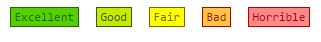
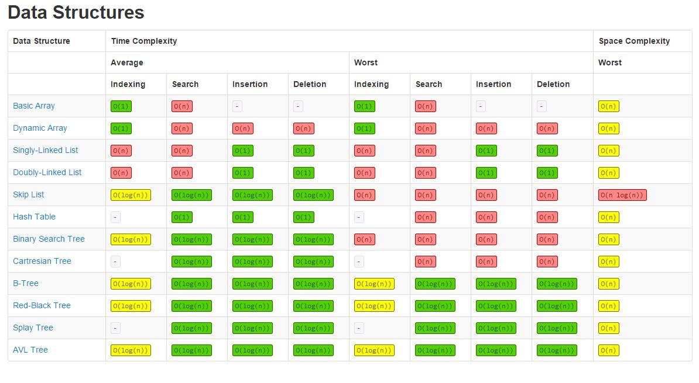
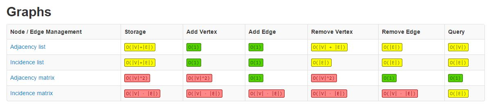
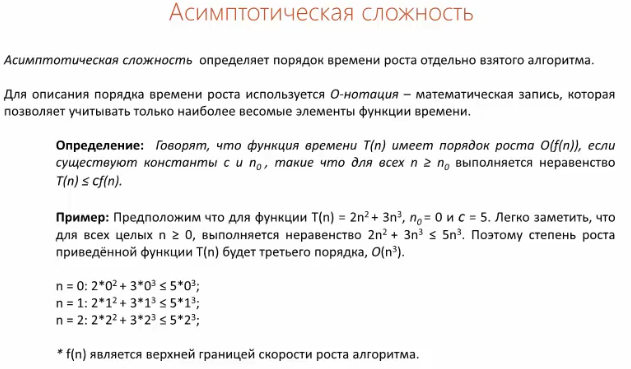
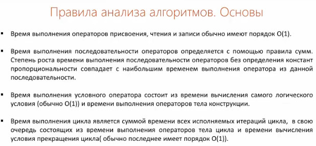
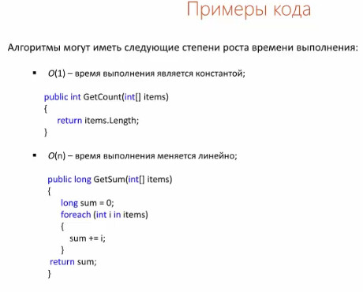
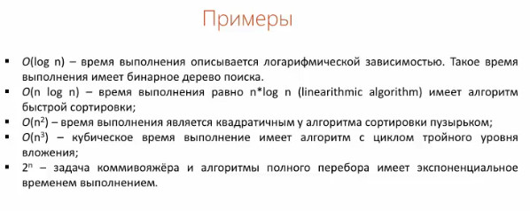
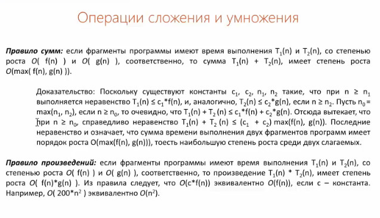
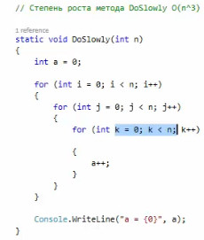

## Big O notation

- ###### [Graphs](#graphs)
- ###### [Definition](#basic_definitions)
- ###### [Definition Rules](#definition_rules)

#### graphs

#### basic_definitions

#### definition_rules

