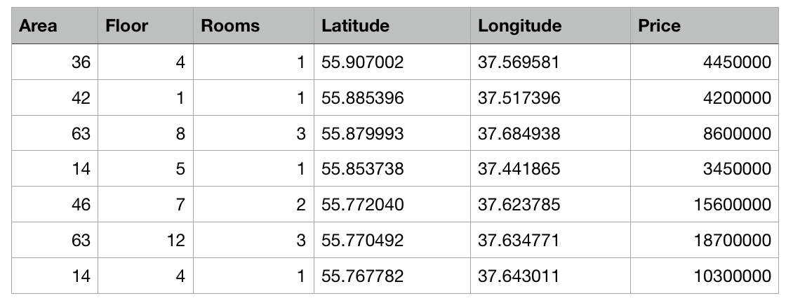
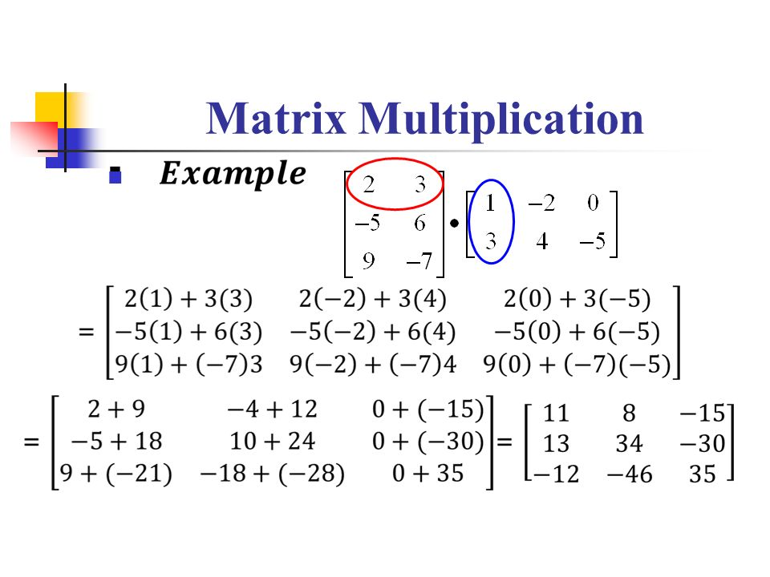

<h3 style="text-align: center;"><b>Физтех-Школа Прикладной математики и информатики (ФПМИ) МФТИ</b></h3>


---

<h2 style="text-align: center;"><b>Элементы линейной алгебры</b></h2>

В этом ноутбуке мы познакомимся с основными понятиями <b>линейной алгебры</b>.

### План

0. Зачем это нужно и что это такое?
1. Векторы и операции с ними
2. Матрицы и операции с ними

### 0. Зачем это нужно и что это такое?

В машинном обучении (и в науке о данных), как ни странно, во главе угла стоят **ДАННЫЕ**. Без них невозможен был бы никакой анализ, не было бы машинного обучения и глубокого обучения, не было бы искусственного интеллекта в современном его понимании.

Данные бывают самой разной природы -- числовые, текстовые, изображения, звук. Однако компьютер может работать только с одной вещью -- с числами (а на низшем уровне, как мы знаем, это просто операции над единицами и нулями). Поэтому любая информация, будь то тексты, звук или картинки, преобразуются в числа каким-либо специальным образом.


Соответственно, именно из-за того, что данные часто очень удобно представлять в виде векторов и матриц (а при разработке моделей машинного обучения -- параметры этих моделей тоже всегда удобно представлять в виде матрицы), и появилась связь Deep Learning и Линейной алгебры (спойлер: нейросети есть просто набор матриц, взаимодействующих друг с другом определённым образом).

**Демки**
>https://www.youtube.com/watch?v=aR6M0MQBo2w

>http://vecg.cs.ucl.ac.uk/Projects/projects_fonts/projects_fonts.html

**Пример:**


<p style="text-align:center">-- матрица. <br>Одна строчка этой матрицы -- это вектор. Один столбец этой матрицы -- тоже вектор.</p>

#### Определение

[Wikipedia](https://ru.wikipedia.org/wiki/%D0%9B%D0%B8%D0%BD%D0%B5%D0%B9%D0%BD%D0%B0%D1%8F_%D0%B0%D0%BB%D0%B3%D0%B5%D0%B1%D1%80%D0%B0)  
**Лине́йная а́лгебра** — раздел алгебры, изучающий объекты линейной природы: векторные (или линейные) пространства, линейные отображения, системы линейных уравнений, среди основных инструментов, используемых в линейной алгебре — определители, матрицы, сопряжение.

Для нас из линейной алгебры сейчас представлят интерес только два объекта -- вектор и матрица. Давайте о них и поговорим.

### 1. Векторы и операции с ними

**Ве́кторное (или лине́йное) простра́нство** — математическая структура, которая представляет собой набор элементов, называемых **векторами**, для которых определены операции сложения друг с другом и умножения на число — **скаляр**. Эти операции подчинены восьми аксиомам (нам эти 8 аксиом сейчас не слишком важны).

В школе вы привыкли, что вектор -- это что-то такое:


Если посмотреть на аналитическую запись, то это будут какие-то два числа, характеризующие вектор. Например, $v = (5, -4)$, или $m = (0, 100)$, это будут вектора **на плоскости**, иначе говоря, элементы линейного пространства размерности 2 (две координаты).

---

#### Упражнение 1

Нарисуйте несколько векторов на плоскости, запишите их в аналитическом виде.

---

Однако что будет, если мы повысим размерность?  
Ничего особенного, просто вырастет количество координат, которыми представляется вектор. 

Например, в пространстве размерности 3 это всё ещё будет направленный отрезок. 

---

#### Упражнение 2

Нарисовать векторы: $a = (5, 0, -1)$, $b = (1,1,1)$, $c = (0.5, 1.5, -3.2)$

---

Однако пространства большей размерности нам представить визуально уже сложно. Но на математическом языке вектор, принадлежащий пространству размерности 15, будет ни чем иным, как просто набором из 15 упорядоченных чисел: $a = (1,1,1,1,1,1,1,1,1,1,1,1,1,1,1)$

#### Операции над векторами


***1). Сложение и вычитание:***

На плоскости есть правила треугольника и параллелограмма, чтобы осуществлять геометрическое сложение и вычитание векторов. Аналитически же мы, по сути, просто складываем/вычитаем соответствующие координаты (их ещё называют компоненты) векторов. 

Поэтому операции сложения и вычитания над векторами есть ни что иное, как сложение и вычитание соответствующих компонент этих векторов:

$a~+~b = (a_1, a_2, .., a_n) + (b_1, b_2, .., b_n) = (a_1 + b_1, a_2 + b_2, .., b_n + b_n)$

Вектор + Вектор = **Вектор**

$a~-~b = (a_1, a_2, .., a_n) - (b_1, b_2, .., b_n) = (a_1 - b_1, a_2 - b_2, .., b_n - b_n)$

Вектор - Вектор = **Вектор**

**Примеры:**

$(-15, 10) - (5, 6) = (-20, 4)$  

$(1, 0, 100) + (2, 3, 1000) = (3, 3, 1100)$

***2). Умножение:***

Умножать векторы можно по разному. Выделим три типа умножения:

*а). Поэлементное умножение (произведение):*

$a~*~b = (a_1, a_2, .., a_n) * (b_1, b_2, .., b_n) = (a_1 * b_1, a_2 * b_2, .., b_n * b_n)$

Вектор \* Вектор = **Вектор**

*б). Скалярное произведение*

$a~\cdot~b = (a_1, a_2, .., a_n) \cdot (b_1, b_2, .., b_n) = a_1b_1 + a_2b_2 + .. + b_nb_n = \sum_{i=1}^{n} a_ib_i$

Вектор $\cdot$ Вектор = **Скаляр**

*в). Векторное произведение*

Оно нам не пригодится, но знать его очень полезно для ориентации в этой теме. Подробнее [тут](http://www.mathprofi.ru/vektornoe_proizvedenie_vektorov_smeshannoe_proizvedenie.html).

---

#### Упражнение 3

Перемножьте векторы поэлементно и скалярно:

1). $(1,2,3)$ и $(10, 100, -4)$  

2). $(0, -5, 0.5)$ и $(2, -2.3, 11)$   

3). $(1, 1, 1, 1, 1, 1)$ и $(2, -2, -3, -100, 33, 0.55)$  

4). $(5, 2)$ и $(1, 2, 3)$

---

***3). Деление:***

Под делением векторов мы будем понимать поэлементное деление. Однако будьте осторожны -- в случае деления на 0 договоримся считать, что значение не определено (Nan).

$a~/~b = (a_1, a_2, .., a_n)~/~(b_1, b_2, .., b_n) = (a_1~/~b_1, a_2~/~b_2, .., b_n~/~b_n)$

Вектор / Вектор = **Вектор**

---

#### Упражнение 4

Поделите векторы из пункта 3 предыдущего упражнения.

---

Как видите, ничего сложного нет.

### 3. Матрицы и операции с ними

Под матрицами будем понимать математический объект. Грубо говоря, матрицы -- это такие таблицы (и да простит меня кафедра высшей математики МФТИ). У них есть строки и столбцы, то есть это объекты, у которых два размера -- длина по строкам и длина по столбцам:

$$
A = \begin{bmatrix}
    x_{11} & x_{12} & x_{13} & \dots  & x_{1n} \\
    x_{21} & x_{22} & x_{23} & \dots  & x_{2n} \\
    \vdots & \vdots & \vdots & \ddots & \vdots \\
    x_{m1} & x_{m2} & x_{m3} & \dots  & x_{mn}
\end{bmatrix}
$$

Размер матрицы, изображённой выше -- $(m, n)$.  

Можно посмотреть на матрицы и с другой стороны -- как вектор векторов (кстати, вам пригодится именно эта интерпретация в дальнейшем при программировании на NumPy).

#### Операции над матрицами

Сложение, вычитание, поэлементное умножение и поэлементное деления матриц осуществляется точно так же, как и для векторов -- соответствующие элементы складываются/вычитаются/умножаются.

Однако при этих операциях нужно учесть одно -- размеры матриц **должны полностью совпадать**.

---

#### Упражнение 5

Сложите, вычтите, поэлементно умножьте и поделите матрицы:

1). 
$
A = \begin{bmatrix}
    1 & 2 & 10 \\
    5 & 1 & -13
\end{bmatrix}
$ 
и
$
B = \begin{bmatrix}
    -5 & -5 & 3 \\
    0 & 1 & 2
\end{bmatrix}
$

2). 
$
A = \begin{bmatrix}
    1 & 2 & 10 \\
    5 & 1 & -13
\end{bmatrix}
$ 
и
$
B = \begin{bmatrix}
    -5 & -5 & 3 & 15 \\
    0 & 1 & 2 & 100
\end{bmatrix}
$

3). 
$
A = \begin{bmatrix}
    1 & 2 & 10 \\
    5 & 1 & -13
\end{bmatrix}
$ 
и
$
B = \begin{bmatrix}
    -5 & -5 \\
    0 & 1 \\
    10 & 20 \\
    -15.5 & -1
\end{bmatrix}
$

---

Теперь определим очень важную операцию -- **матричное произведение** (не поэлементное):


С первого раза может быть не очень понятно. Лучше разобрать на примере:


```python
import numpy as np
a = np.array(
[
    [1,2],
    [3,4],
    [5,6],
    [7,8]
]
)

b = np.array(
[
    [0,0],
    [0,1]    
]
    
)

print(np.dot(a,b))
```

    [[0 2]
     [0 4]
     [0 6]
     [0 8]]
    

---

#### Упражнение 6

Перемножьте матрицы (матрично) (они умышленно даны в таком виде -- нужно привыкать):  

**a):**   
A = [[2, 3, -2], [9, 0, 1], [1, 0, 0]]  
B = [[1], [2], [3]]  

**b):**  
A = [[10, 20, 30, 5], [-9, -1, 2, -1]]  
B = [[1, 1], [2, 2], [5, 5], [11, 12]]  

**c):**
A = [[10, 20, 30, 5], [-9, -1, 2, -1]]  
B = [[1, 1], [2, 2], [5, 5]]  

Почему матричное произведениие определяется именно так? Такое определение очень естественно возникает в линейной алгебре и имеет много полезных свойств. Сейчас мы не будем из разбирать, единственное, что нам важно -- матричное умножение позволяет очень удобно работать с данными.

# Матричные разложения

### Полезные ссылки

*1. Сайт, на котором очень понятно объясняется аналитическая геометрия и линейная алгебра (слева есть меню, там можно выбирать темы): http://www.mathprofi.ru/vektory_dlya_chainikov.html*

*2. Наглядное объяснение многих математических идей: https://brilliant.org/*

*3.  Ещё один прекрасный в этом отношении канал: https://www.youtube.com/watch?v=fNk_zzaMoSs*


```python

```
