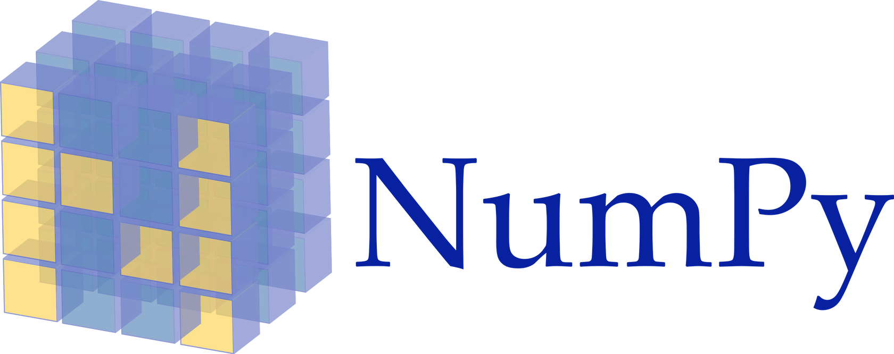

<h3 style="text-align: center;"><b>Физтех-Школа Прикладной математики и информатики (ФПМИ) МФТИ</b></h3>


---

<h2 style="text-align: center;"><b>Python. Занятие 2: Numpy, Scipy</b></h2>



#### При подготовке ноутбука использовался сайт: http://www.inp.nsk.su/~grozin/python/

---

## Библиотека NumPy

Пакет **`NumPy`** предоставляет $n$-мерные однородные массивы (все элементы одного типа); в них нельзя вставить или удалить элемент в произвольном месте. В `numpy` реализовано много операций над массивами в целом. Если задачу можно решить, произведя некоторую последовательность операций над массивами, то это будет столь же эффективно, как в `C` или `matlab`, поскольку функции этой библиотеки реализованы на C, и мы просто вызываем из из питона.


```python
# стандартное название для импорта numpy - np
import numpy as np
import math
```


```python
# from numpy import *
# как и влюбом другом языке и библиотке, так делать нельзя. Вы очень быстро запутаетесь в функциях из numpy 
# и запутаете всех, кто читает ваш код
```

## Векторы и матрицы в numpy

* **Одномерные массивы**. Я предполагаю, что почти все знают про обычные массивы и про операции над ними. Они выглядят следующим образом:


```python
x = [3, 4, 1]
print(x)
```

Давайте преобразуем наш массив в __numpy__ массив:


```python
a = np.array(x)
print(a, type(a))
```

`print` печатает массивы в удобной форме.


```python
print(a/89)
```

* **Многомерные массивы**


```python
# Простая матричка
x = [[3, 4, 1],
     [1, 2, 3]]
print(x)
```


```python
a = np.array(x)
print(a)
```


```python
# Реально многомерный массив
x = [
        [ [1, 2, 3], [4, 5, 6]],
        [ [7, 8, 9], [10, 11, 12]] 
    ]
print(x)
```


```python
a = np.array(x)
print(a)
```

Как мы видим, для numpy нет никакой разницы, сколько измерений у матрицы, все они представляются numpy.ndarray

# Типы данных в numpy

`numpy` предоставляет несколько типов для целых (`int16`, `int32`, `int64`) и чисел с плавающей точкой (`float32`, `float64`).


```python
a.dtype, a.dtype.name, a.itemsize
```


```python
b = np.array([0., 2, 1])
b.dtype
```

Точно такой же массив.


```python
c = np.array([0.1, 2, 1], dtype=np.float64)
print(c)
```

Преобразование данных


```python
print(c.dtype)
print(c.astype(int))
print(c.astype(str))
```

Так для чего нам нужны эти массивы, почему нам может не хватать возможностей обычных массивов?

# Методы массивов в numpy
Класс `ndarray` имеет много методов.


```python
print(dir(a))
```

## Одномерные массивы
* числовые операции и нахождение статистик


```python
x = [1, 2, 0, 3, 4]
a = np.array(x)
```


```python
# У массивов можно легко и быстро посчитать разные статистики
a.std(), a.sum(), a.prod(), a.min(), a.max(), a.mean()
```


```python
# массивы можно умножать и складывать со скалярами и другими массивами, операции проходят поэлементно
a * 2, a / 2, a + 1, a - 1
```


```python
a + a, a * a, a / a, a ** 2
```


```python
# (с листами из питона так не получится, для них сложение означает конкатенацию)
print(type(x))
print(x)
print(x + x)
print(x * 2)
print(x ** 2)
```

* Поэлементные операции


```python
# В numpy есть почти функции, которых хватает для построения почти любого расчета
np.exp(a), np.sin(a), np.cos(a), np.round(a) # и много других, лучше просто загуглить, когда вам что-то понадобится
```

* сортировка/добавление/удаление элементов массива


```python
b = np.arange(9, -1,-1)
print(f'sorted b {np.sort(b)}')
print(f'original b {b}')
b.sort()
print(f'original b after inplace sort {b}')
```

Функции delete, insert и append не меняют массив на месте, а возвращают новый массив, в котором удалены, вставлены в середину или добавлены в конец какие-то элементы.


```python
a = np.arange(10, -1, -1)
a = np.delete(a, [5, 7])
print(a)
```


```python
a = np.insert(a, [2, 3], [-100, -200])
print(a)
```


```python
a = np.append(a, [1, 2, 3])
print(a)
```

## Многомерные массивы

В случае многомерных массивов работает все, что мы только что попробовали для одномерных, но появляются и новые возможности.

* работа с shape массива

У многомерны массивов есть понятие осей (их еще можно назвать измерениями). Так как одни и те же данные могут храниться в массивах разной формы, в numpy есть методы, чтобы эту форму менять

`ndarray.shape` — размеры массива, его форма. Это кортеж натуральных чисел, показывающий длину массива по каждой оси. Для матрицы из n строк и m столбов, shape будет (n,m). 

В $n$-мерном случае возвращается кортеж размеров по каждой координате.


```python
x = [[1, 2, 3],
     [4, 5, 6]]
a = np.array(x)
print('shape():', a.shape,'\nndim():', a.ndim, '\nsize():', a.size, '\nlen():', len(a))
```

**Вопрос:** 
 >Как связаны элементы кортежа shape, ndim, size?

**Ответ:**

**Вопрос:**
>Каковы значения shape, ndim, size, len для картинки RGB 160x100? 

>А для массива из 1000 таких картинок?

**Ответ:**

Для смены shape есть методы reshape, flatten, ravel


```python
# reshape
print(a.reshape(3, 2))
# вместо одной из осей можно просто вставить -1, тогда numpy попытается сам понять, какое там должно быть число
print(a.reshape(-1, 2))
# если такое число не получится найти, то будет ошибка
print(a.reshape(-1))
```


```python
# flatten и ravel очень похожи, они вытягивают матрицу любой размерности в строчку
# Единственно отличие в том, что flatten возвращает копию массива, вытянутую в строчку
# а ravel - просто view(т.е. не происходит реального копирования значений)
# Пример снизу показывает это отличие
flattened = a.flatten()
flattened[0] = 1000
print(a)
raveled = a.ravel()
raveled[0] = 1000
print(a)
```

* Подсчет статистик по осям


```python
print(a)
```


```python
# Если не написать axis, то статистика посчиатется по всем массиву
# Если axis=1, то для трехмерной матрицы суммирование (например) будет идти по элементам с индексами (i, *, j)
# Если axis=(1, 2), то для трехмерной матрицы суммирование (например) будет идти по элементам с индексами (i, *, *)
a.std(axis=0), a.sum(axis=0), a.prod(axis=0), a.min(axis=0), a.max(axis=0), a.mean(axis=0)
```


```python
# Посчитаем, итерируясь по 1 оси
a.std(axis=1), a.sum(axis=1), a.prod(axis=1), a.min(axis=1), a.max(axis=1), a.mean(axis=1)
```

## Булевы массивы
Булевы массивы не настолько особенны, чтобы выделять их в отдельную категорию, но у них есть несколько интересных свойств, которые нам помогут. Булевы массивы естественно возникают в нашей программе при сравнении каких-то двух массивов в numpy (==,>,>=,<,<=).


```python
a = np.array([1, 2, 3])
b = np.array([1, 2, 0])

a == b, a > b, a >= b, a < b, a <= b
```

Посмотрим, что мы можем делать с такими массивами


```python
a = np.array([True, False, True])
b = np.array([False, False, True])

# Логические поэлементные операции
print(f'a and b {a & b}')
print(f'a or b {a | b}')
print(f'not a {~a}')
print(f'a xor b {a ^ b}')
```


```python
# Логические операции над всеми элементами массива, в них тоже можно использовать параметр axis
a.any(), a.all()
```


```python
# Если к булевому массиву применить функции, предназначенные только для чисел, 
# то перед применением все True сконвертируются в 1, а False в 0
# Здесь также можно добавить параметр axis
a.mean(), a.max(), a.sum(), a.std()
```

**Задание на булевы массивы:**
> Пусть у нас есть два одномерных массива y_pred - предсказанный нашей моделью класс, и y_true - настоящий класс. Посчитайте accuracy нашего классификатора на этих данных (долю случаев, в которых реальный класс совпал с предсказанием)


```python
y_pred = np.array([1, 2, 1, 2, 1, 1])
y_true = np.array([1, 2, 1, 1, 1, 1])

<ваш код здесь>
```

# Полезные функции из numpy

Также в numpy есть много полезных методов для получения готовых массивов какого-то вида

* Функция **arange** подобна range. Аргументы могут быть с плавающей точкой. Следует избегать ситуаций, когда (конец−начало)/шаг - целое число, потому что в этом случае включение последнего элемента зависит от ошибок округления. Лучше, чтобы конец диапазона был где-то посредине шага.


```python
# поиграемся с питоновским методом range
print(list(range(8)))
print(*range(0, 8))
print(*[2,5])
print(2,5)
```


```python
# в нем нельзя использовать не целый шаг
print(*range(0, 8, 0.5))
```


```python
# перейдем к arange
# здесь не целый шаг использовать уже можно
print(type(np.arange(0, 8)))
print(np.arange(0, -8, -0.5))
```


```python
print(np.arange(0, 8, 0.5))
```

Но самое главное:


```python
%time np.arange(0, 50000000)
%time list(range(0, 50000000))
%time range(0, 50000000)
```

**Вопрос на знание питона**: почему просто range занял 12 мкс, даже меньше, чем numpy?

* Еще один метод, похожий на arange это **linspace**. С его помощью можно создавать последовательности чисел с постоянным шагом. Начало и конец диапазона включаются; последний аргумент - число точек.


```python
%time a = np.linspace(0, 8, 8)
%time print(a)
```

* **Быстродействие**. Массивы, разумеется, можно использовать в `for` циклах. Но при этом теряется главное преимущество `numpy` - быстродействие. Всегда, когда это возможно, лучше использовать операции, определенные в numpy.


```python
%%time 
res = a + a
```


```python
%%time
res = []
for value in a:
    res.append(value + value)
```

(в совсем простых операциях, таких как сложение двух чисел, питон не уступает в скорости C++ или C, а поэтому использование numpy не дает ввыигрыша, но в более тяжелых вычислениях разница становится колоссальнной)

* Еще один способ создавать стандартные массивы - __`numpy.eye(N, M=None, ...)`__, __`numpy.zeros(shape, ...)`__, __`numpy.ones(shape, ...)`__.

Первая функция создает единичную матрицу размера $N \times M$; если $M$ не задан, то $M = N$. 

Вторая и третья функции создают матрицы, состоящие целиком из нулей или единиц соответственно. В качестве первого аргумента необходимо задать размерность массива — кортеж целых чисел. В двумерном случае это набор из двух чисел: количество строк и столбцов матрицы.

__Примеры:__


```python
b = np.eye(5)
print("Единичная матрица:\n", b)
```


```python
c = np.ones((7, 5))
print("Матрица, состоящая из одних единиц:\n", c)
```

__Обратите внимание: размерность массива задается не двумя аргументами функции, а одним — кортежем!__ 

Вот так —  __`np.ones(7, 5)`__ — создать массив не получится, так как функции в качестве параметра `shape` передается `7`, а не кортеж `(7, 5)`.

**Задание на создание матриц:**
> Создайте матрицу размера 4х5, у которой все элементы стоящие на диагонали равны -1, а все остальные равны 0.5


```python
<ваш код здесь>
```

# Slices, Fancy Indexing and stuff

* Обращение по слайсам

Так же как и для обычных листов, для numpy массивов доступно обращение по слайсам (a[2:5:2], 2:5:2 - слайс). Но есть одно отличие. В numpy можно писать несколько слайсов через запятую, чтобы сделать _срез_ сразу по нескольким осям - a[2:5, 1:4]. 


```python
a = np.array([
                [1, 2, 3, 4],
                [5, 6, 7, 8],
                [9, 10, 11, 12]
             ])
print(a)
print(a[0:2, 1:3])
```

* Обращение по слайсам с добавлением новых осей. 

В NumPy к размерностям объектов можно добавлять фиктивные оси с помощью np.newaxis. Для того, чтобы понять, как это сделать, рассмотрим пример:


```python
a = np.arange(1, 4, 1)
print(a)
print('Вектор a с newaxis --> вектор-строка:\n', a[None, :])
print('Полученная размерность:', a[np.newaxis, :].shape)
```

* Обращение по индексам

в numpy можно обращаться сразу к нескольким элементам массива, которые не идут подряд, передав в качестве аргумента list или numpy array индексов


```python
a = np.array([0, 1, 2, 3])
a[0], a[[0, 1, 1, 2]], a[np.array([0, 1, 1, 2])]
```


```python
# многомерный случай
z = np.array([[1,2], [3,4]])
print(z)
# можно передать лист с индексами для каждого из измерений. 
# В данном случае выберутся элементы с индексами (0, 0) и (1, 1). Результат - одномерный массив
print(z[[0,1], [0,1]])
```

* Обращение по булевому массиву


```python
print(a)
print(a[[True, False, True, True]])
# Как мы уже выяснили, в результате сравнения numpy массивов получается булев массив, 
# его очень удобно использовать, чтобы обращаться к элементам, удовлетворяющим какому-то условию
print(a[a > 1])
```

В NumPy к размерностям объектов можно добавлять фиктивные оси с помощью np.newaxis. Для того, чтобы понять, как это сделать, рассмотрим пример:

* Присвоение значений во view

Когда мы используем слайсы для выборки каких-то элементов массива, нам возвращается не новый массив с этими элементами, а просто объект view, который ссылается на какие-то ячейки в реальном массиве. Поэтому мы можем сделать так:


```python
a = np.array([1, 2, 3])
b = a[0:2]
print(b)
b[0] = 100
print(b)
print(a)
```

Изменив элемент во view b, мы поменяли элемент и в массиве а. Если же обратиться по списку координат или булевому массиву, так не получится


```python
a = np.array([1, 2, 3])
b = a[[0, 1]]
print(b)
b[0] = 100
print(b)
print(a)
```


```python
a = np.array([1, 2, 3])
b = a[[True, True, False]]
print(b)
b[0] = 100
print(b)
print(a)
```

Означает ли это, что не сработают выражения вида:
> a[[0, 1]] = 100

> a[[True, True, False]] = 100

Присваивания сработают, потому что в данном случае копия массива создаваться не будет, вместо этого вызовется магический метод питона \_\_setitem\_\_. Очень удобная особенность питона, про которую не стоит забывать.


```python
a = np.array([1, 2, 3])
a[[True, True, False]] = 100
print(a)
```

Если же слева будет не просто обращение по индексу, а двойное обращение по индексу, то питону придется вычислить значение 
> a[[True, True, False]]

тем самым создав копию, и только потом взять у него нулевой элемент. Поэтому 0 присвоится в массив-копию, который тут же уничтожится.


```python
a = np.array([1, 2, 3])
a[[True, True, False]][0] = 100
print(a)
```

**Задание на slicing:**
> Создайте матрицу 4х4, у которой элементы i=4-j равны 1, а остальные - нулю


```python
<ваш код здесь>
```

# Линейная Алгебра

До этого мы рассматривали разные операции numpy, которые не связаны напрямую с линейной алгеброй. Пришло время это изменить)

* Скалярное произведение 
$a~\cdot~b = (a_1, a_2, .., a_n) \cdot (b_1, b_2, .., b_n) = a_1b_1 + a_2b_2 + .. + b_nb_n = \sum_{i=1}^{n} a_ib_i$:


```python
a = np.array([1, 2, 3])
b = np.array([2, 3, 4])
print(a,b)
```


```python
a @ b
```


```python
print(np.matmul(a, b))
```


```python
* Векторы и матрицы
```


```python
b = np.array([
    [1, 2, 3],
    [4, 5, 6]
])
```

Наш 2-мерный массив __b__, также его можно назвать матрицей, имеет 2 строки и 3 столбца.
То есть наша матрица состоит из 2 вектор-строк:


```python
print(b)
b[0:2,0:1]
```


```python
b[1:2]
```

Обычно в линейной алгебре под любым вектором подразумевается вектор-столбец. Наша матрица содержит 3 вектор-стобца:


```python
b[:, 0:1]
```


```python
b[:, 1:2]
```


```python
b[:, 2:3]
```


```python
a @ b
```

## Операции с матрицами


```python
A = np.array([[1, 0], [0, 1]])
B = np.array([[4, 1], [2, 2]])
```

__Напоминание теории.__ __Транспонированной матрицей__ $A^{T}$ называется матрица, полученная из исходной матрицы $A$ заменой строк на столбцы. Формально: элементы матрицы $A^{T}$ определяются как $a^{T}_{ij} = a_{ji}$, где $a^{T}_{ij}$ — элемент матрицы $A^{T}$, стоящий на пересечении строки с номером $i$ и столбца с номером $j$.

В `NumPy` транспонированная матрица вычисляется с помощью функции __`numpy.transpose()`__ или с помощью _метода_ __`array.T`__, где __`array`__ — нужный двумерный массив.


```python
a = np.array([[1, 2], [3, 4]])
b = np.transpose(a)
c = a.T
```


```python
print("Матрица:\n", a)
print("Транспонирование функцией:\n", b)
print("Транспонирование методом:\n",  c)
```


```python
a @ b
```

__Напоминание теории.__ Операция __умножения__ определена для двух матриц, таких что число столбцов первой равно числу строк второй. 

Пусть матрицы $A$ и $B$ таковы, что $A \in \mathbb{R}^{n \times k}$ и $B \in \mathbb{R}^{k \times m}$. __Произведением__ матриц $A$ и $B$ называется матрица $C$, такая что $c_{ij} = \sum_{r=1}^{k} a_{ir}b_{rj}$, где $c_{ij}$ — элемент матрицы $C$, стоящий на пересечении строки с номером $i$ и столбца с номером $j$.

В `NumPy` произведение матриц вычисляется с помощью функции __`numpy.dot(a, b, ...)`__ или с помощью _метода_ __`array1.dot(array2)`__, где __`array1`__ и __`array2`__ — перемножаемые матрицы.


```python
y = np.array([1, 0])
z = np.dot(A, y)
```


```python
y = np.linalg.solve(A, z)
print(y)
```

#### Линейная алгебра (модуль `np.linalg`)zxxz


```python
A = np.array([[1, 0], [1, 0]])
x = np.array([[4, 1], [2, 2]])
b = np.dot(A, x)
print(b)
```

* Решение линейной системы __$Ax=b$__:


```python
x = np.linalg.solve(A, b)
print(x)
```

### Библиотека SciPy

* Оптимизация функции (нахождение минимума/максимума):


```python
from scipy.optimize import minimize
```

Обязательно посмотрите документацию, сходу не очевидно, как именно использовать:


```python
?minimize
```

Опмтимизируем (минимизируем) простую функцию:


```python
def f(x):
    return x ** 2
```


```python
%matplotlib inline
import matplotlib.pyplot as plt

x = np.arange(-3, 3, .1)
y = f(x)

plt.plot(x,y)
# plt.show()
```


```python
res = minimize(f, x0=100)
```


```python
res
```

Тут нужно смотреть на 4 строчки: `fun, message, success и x`  
`fun` - значние функции в точке минимума  
`message` - служебное сообщение об окончании процесса (может быть "успешно", как здесь, или сообщение о том, что что-то пошло не так ("не сошлось"))  
`success` - True, если успешно сошлось (но лучше всегда всё же смотреть и `message`)  
`x` - точка, в которой достигается минимум

Можно в аргумент `method` подавать разные ключевые слова для смены метода оптимизации, подробнее о них лучше читать документацию или погуглить.

* Интегрирование:


```python
from scipy.integrate import quad, odeint
from scipy.special import erf
```


```python
def f(x):
    return np.exp(-x ** 2)
```


```python
%matplotlib inline
import matplotlib.pyplot as plt

x = np.arange(-3, 3, .1)
y = f(x)

plt.plot(x,y)
plt.show()
```

Адаптивное численное интегрирование (может быть до бесконечности). `err` - оценка ошибки.


```python
res, err = quad(f, 0, np.inf)
print(np.sqrt(np.pi) / 2, res, err)
```


```python
res, err = quad(f, 0, 1)
print(np.sqrt(np.pi) / 2 * erf(1), res, err)
```

## Поиграем с изображением
Изображение - это тензор. Загрузим картинку из сети.


```python
from PIL import Image
import requests
from io import BytesIO

url = 'https://s8.hostingkartinok.com/uploads/images/2018/08/308b49fcfbc619d629fe4604bceb67ac.jpg'

response = requests.get(url)
img = Image.open(BytesIO(response.content))
```

Код выше был скопирован с гугла и не представляет для нас большого интереса. Главное - получить изображение в формате numpy:


```python
img = np.array(img)
img.shape
```


```python
from matplotlib import pyplot as plt
plt.imshow(img)
```


```python
img2 = img[:, :, ::-1]
plt.imshow(img2)
```


```python
img3 = img[:, ::-1]
plt.imshow(img3)
```


```python
batch = np.concatenate([img[None, :, :, :], img2[None, :, :, :], img3[None, :, :, :]])
batch.shape
```


```python
img4 = img.sum(axis=2)
plt.imshow(img4, cmap=plt.cm.gray)
```

## Список материалов для самостоятельного изучения

*Статья на Хабре по основам NumPy - https://habr.com/post/121031/*  

*100 задач по NumPy для любителей посидеть вечерком за чашечкой программирования* - https://pythonworld.ru/numpy/100-exercises.html  

*Очень крутой, продвинутый ноутбук по NumPy* - https://nbviewer.jupyter.org/github/vlad17/np-learn/blob/master/presentation.ipynb

*Штука, которая вам в будущем может пригодиться ;)* - https://stackoverflow.com/questions/27948363/numpy-broadcast-to-perform-euclidean-distance-vectorized/35814006  

*Лекции по SciPy и NumPy* - http://www.scipy-lectures.org/index.html
